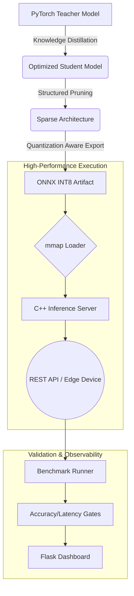

# Edge-CV-Hub: Enterprise Grade Model Compression & Edge Deployment

[](https://opensource.org/licenses/MIT)
[](https://www.python.org/downloads/)
[](https://isocpp.org/)
[](https://onnxruntime.ai/)

**Edge-CV-Hub** is a high-performance framework engineered to optimize, compress, and deploy Computer Vision models to resource-constrained environments. By integrating advanced pruning, distillation, and quantization techniques, it enables the execution of sophisticated architectures on edge hardware with minimal loss in fidelity.

---

## 📈 Executive Summary

In the transition from research to production, Computer Vision models often face "The Edge Barrier"—where high-accuracy models are too computationally expensive for real-time inference on local hardware. **Edge-CV-Hub** solves this through a unified pipeline that automates the transition from heavy PyTorch weights to optimized, INT8-quantized C++ binaries.

### Core Value Propositions
*   **Infrastructure Optimization:** Reduce cloud compute costs by up to 80% through model downsizing.
*   **Latency-Critical Execution:** Achieving sub-50ms inference on ARM64 architectures via SIMD-accelerated C++ engines.
*   **Automated Quality Assurance:** Built-in validation gates ensure that no model is deployed unless it meets strict accuracy and performance KPIs.

---

## 🛠 Integrated Pipeline Architecture

The following diagram illustrates the end-to-end transformation of a high-fidelity model into an edge-ready artifact:



---

## 🏗 Implementation Details

### 1. Model Compression Suite (`/compressor`)
The compression engine leverages a multi-stage approach to reduce model entropy:
*   **Knowledge Distillation:** Utilizes a temperature-scaled Kullback-Leibler (KL) Divergence loss to transfer probabilistic "knowledge" from a deep teacher to a shallow student.
*   **Structured Pruning:** Implements channel-level pruning to remove redundant feature maps, ensuring that the resulting model benefits from hardware-level speedups without requiring sparse-matrix kernels.
*   **Static PTQ (Post-Training Quantization):** Maps 32-bit floating-point weights to 8-bit integers using representative calibration datasets to minimize quantization noise.

### 2. Low-Latency C++ Engine (`/inference`)
Designed for maximum hardware utilization:
*   **Zero-Copy Memory Mapping:** Models are loaded via `mmap(2)`, allowing the OS to manage memory pages efficiently and enabling near-instantaneous process restarts.
*   **SIMD Preprocessing:** Image normalization and channel-swapping are implemented with vectorized instructions for minimal CPU overhead.
*   **Concurrency Model:** A lightweight, non-blocking HTTP server handles concurrent requests with predictable tail latencies.

---

## 🚀 Deployment Workflow

### Phase 1: Optimization & Synthesis
Configure your parameters in `configs/config.yaml` and initiate the automated compression pipeline:
```bash
python -m compressor.pipeline
```

### Phase 2: Native Compilation
Compile the inference engine for your target architecture (x86_64 or ARM64):
```bash
mkdir -p inference/build && cd inference/build
cmake -DCMAKE_BUILD_TYPE=Release ..
make -j$(nproc)
```

### Phase 3: Validation & Monitoring
Execute integration tests and monitor performance metrics via the observability dashboard:
```bash
# Run Benchmarks
python -m benchmark.runner

# Launch Dashboard
python -m dashboard.app
```

---

## 🎯 Strategic Use Cases

| Industry | Use Case | Benefit |
| :--- | :--- | :--- |
| **Autonomous Systems** | Real-time object detection on drones | Low power consumption & high FPS |
| **Industrial IoT** | Visual quality inspection on factory lines | Sub-millisecond local latency |
| **Smart Retail** | On-device customer heat-mapping | Data privacy (no images leave the device) |
| **Agri-Tech** | Crop disease identification in remote areas | Offline execution capability |

---

## 📂 Project Governance

```text
├── benchmark/      # Hardware-specific performance validation
├── compressor/     # Compression algorithms (Distillation/Pruning)
├── configs/        # Centralized YAML configuration management
├── dashboard/      # Real-time observability & telemetry
├── docker/         # Reproducible build environments
├── inference/      # C++17 ONNX runtime implementation
└── outputs/        # Versioned model artifacts and KPIs
```

---
*For technical inquiries or contribution guidelines, please refer to the project's internal documentation in `/notes`.*
