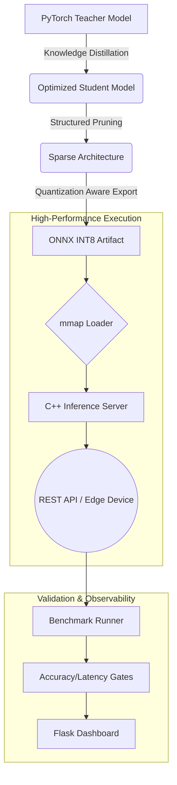

# Edge-CV-Hub Project Context

This document contains the complete source code and explanations for the Edge-CV-Hub project.

## File: .gitignore
**Description:** Specifies intentionally untracked files that Git should ignore.
```text
# Project specific
.venv/
__pycache__/
*.pyc
outputs/
data/
build/
notes/
*.onnx
*.pth
*.log

# IDEs and Editors
.vscode/
.idea/
*.swp
*.swo

# OS related
.DS_Store
Thumbs.db
.ipynb_checkpoints/
```

## File: requirements.txt
**Description:** Lists the Python dependencies required for the project, including ML libraries (PyTorch, ONNX), config management, and dashboard tools.
```text
# ─── ML / Compression ────────────────────────────────────────────────────────
torch>=2.2.0
torchvision>=0.17.0
onnx>=1.16.0
onnxruntime>=1.18.0          # for quantization and accuracy verification
onnxruntime-tools>=1.7.0     # quantize_static API

# ─── Optional: FP16 quantization ─────────────────────────────────────────────
# onnxconverter-common>=1.14.0

# ─── Config ───────────────────────────────────────────────────────────────────
pyyaml>=6.0

# ─── Benchmark runner ─────────────────────────────────────────────────────────
requests>=2.31.0
numpy>=1.26.0
pillow>=10.0.0

# ─── Dashboard ────────────────────────────────────────────────────────────────
flask>=3.0.0
```

## File: hil-test.yml
**Description:** GitHub Actions workflow for Hardware-in-the-Loop (HIL) testing. It cross-compiles the C++ engine, compresses the model, deploys to a QEMU-emulated ARM64 container, and runs performance gates.
```yaml
# .github/workflows/hil-test.yml
# ─────────────────────────────────────────────────────────────────────────────
# Hardware-in-the-Loop (HIL) CI/CD Pipeline
#
# Triggered on every push to main or pull request.
#
# Pipeline stages:
#   1. cross-compile    → build C++ ARM64 binary via Docker buildx
#   2. compress-model   → prune + distill + quantize → INT8 ONNX
#   3. deploy-to-qemu   → spin up ARM64 container with QEMU emulation
#   4. benchmark-hil    → run latency + accuracy suite against container
#   5. gate             → fail build if thresholds not met
#   6. upload-artifacts → store ONNX model + benchmark JSON
# ─────────────────────────────────────────────────────────────────────────────

name: Hardware-in-the-Loop CI

on:
  push:
    branches: [main, develop]
  pull_request:
    branches: [main]

# Cancel in-progress runs on the same branch (saves CI minutes)
concurrency:
  group: ${{ github.workflow }}-${{ github.ref }}
  cancel-in-progress: true

env:
  PYTHON_VERSION: "3.11"
  ORT_VERSION: "1.18.0"
  IMAGE_NAME: edge-cv-server

jobs:
  # ── Job 1: Cross-compile C++ binary ────────────────────────────────────────
  cross-compile:
    name: Cross-compile (ARM64)
    runs-on: ubuntu-latest

    steps:
      - name: Checkout
        uses: actions/checkout@v4

      - name: Set up QEMU (for ARM64 emulation in Docker)
        uses: docker/setup-qemu-action@v3
        with:
          platforms: arm64

      - name: Set up Docker Buildx
        uses: docker/setup-buildx-action@v3

      - name: Build ARM64 inference image
        uses: docker/build-push-action@v5
        with:
          context: .
          file: docker/Dockerfile.inference
          platforms: linux/arm64
          push: false
          tags: ${{ env.IMAGE_NAME }}:${{ github.sha }}
          # Cache layers across runs — avoids re-downloading ORT every time
          cache-from: type=gha
          cache-to: type=gha,mode=max
          outputs: type=docker,dest=/tmp/edge-cv-server.tar

      - name: Upload image tarball
        uses: actions/upload-artifact@v4
        with:
          name: docker-image
          path: /tmp/edge-cv-server.tar
          retention-days: 1

  # ── Job 2: Compress model (Prune + Distill + Quantize) ─────────────────────
  compress-model:
    name: Compress Model (Python)
    runs-on: ubuntu-latest
    # Run in parallel with cross-compile — both take ~10 min

    steps:
      - name: Checkout
        uses: actions/checkout@v4

      - name: Set up Python
        uses: actions/setup-python@v5
        with:
          python-version: ${{ env.PYTHON_VERSION }}
          cache: pip

      - name: Install Python dependencies
        run: pip install -r requirements.txt

      - name: Cache dataset
        uses: actions/cache@v4
        with:
          path: ./data
          key: dataset-${{ hashFiles('configs/config.yaml') }}

      - name: Run compression pipeline
        run: python -m compressor.pipeline
        env:
          EDGE_CV_CONFIG: configs/config.yaml

      - name: Verify ONNX output exists
        run: |
          ls -lh outputs/student_int8.onnx
          python -c "
          import onnx
          m = onnx.load('outputs/student_int8.onnx')
          onnx.checker.check_model(m)
          print('ONNX model is valid')
          "

      - name: Upload ONNX model
        uses: actions/upload-artifact@v4
        with:
          name: onnx-model
          path: outputs/student_int8.onnx
          retention-days: 7

      - name: Upload compression summary
        uses: actions/upload-artifact@v4
        with:
          name: compression-summary
          path: outputs/compression_summary.json

  # ── Job 3 + 4: Deploy to QEMU and benchmark ────────────────────────────────
  benchmark-hil:
    name: HIL Benchmark (ARM64 QEMU)
    runs-on: ubuntu-latest
    needs: [cross-compile, compress-model]
    # Hard timeout — if the server hangs, don't wait forever
    timeout-minutes: 30

    steps:
      - name: Checkout
        uses: actions/checkout@v4

      - name: Set up QEMU
        uses: docker/setup-qemu-action@v3
        with:
          platforms: arm64

      - name: Download Docker image
        uses: actions/download-artifact@v4
        with:
          name: docker-image
          path: /tmp

      - name: Download ONNX model
        uses: actions/download-artifact@v4
        with:
          name: onnx-model
          path: outputs/

      - name: Load Docker image
        run: docker load < /tmp/edge-cv-server.tar

      - name: Start ARM64 inference container
        run: |
          docker run -d \
            --name edge-cv \
            --platform linux/arm64 \
            --memory=512m \
            --cpus=1.5 \
            -p 8080:8080 \
            -v $(pwd)/outputs:/app/model:ro \
            ${{ env.IMAGE_NAME }}:${{ github.sha }}

      - name: Set up Python (for benchmark runner)
        uses: actions/setup-python@v5
        with:
          python-version: ${{ env.PYTHON_VERSION }}
          cache: pip

      - name: Install benchmark dependencies
        run: pip install requests numpy torchvision pillow pyyaml

      - name: Run HIL benchmark suite
        run: python -m benchmark.runner --host localhost --port 8080 --n 100
        env:
          EDGE_CV_CONFIG: configs/config.yaml

      - name: Run hardware gate check
        run: python -m benchmark.gate
        env:
          EDGE_CV_CONFIG: configs/config.yaml

      - name: Print container logs (always, for debugging)
        if: always()
        run: docker logs edge-cv

      - name: Stop container
        if: always()
        run: docker stop edge-cv && docker rm edge-cv

      - name: Upload benchmark report
        uses: actions/upload-artifact@v4
        with:
          name: benchmark-report
          path: outputs/benchmark.json
          retention-days: 30

  # ── Job 5: Post results to PR comment ─────────────────────────────────────
  report:
    name: Post Results
    runs-on: ubuntu-latest
    needs: benchmark-hil
    if: github.event_name == 'pull_request'

    steps:
      - name: Download benchmark report
        uses: actions/download-artifact@v4
        with:
          name: benchmark-report

      - name: Post benchmark summary to PR
        uses: actions/github-script@v7
        with:
          script: |
            const fs   = require('fs');
            const data = JSON.parse(fs.readFileSync('benchmark.json', 'utf8'));
            const lat  = data.latency;
            const acc  = data.accuracy;
            const icon = data.passed ? '✅' : '❌';

            const body = [
              `## ${icon} Hardware-in-the-Loop Benchmark Results`,
              '',
              '| Metric | Value | Gate |',
              '|--------|-------|------|',
              `| p95 Latency | ${lat.p95_ms.toFixed(1)} ms | ≤ ${data.gates.latency_gate_ms} ms |`,
              `| Mean Latency | ${lat.mean_ms.toFixed(1)} ms | — |`,
              `| FPS | ${lat.fps.toFixed(1)} | — |`,
              `| Top-1 Accuracy | ${(acc.accuracy * 100).toFixed(2)}% | ≥ ${(data.gates.accuracy_threshold * 100).toFixed(0)}% |`,
              `| Memory RSS | ${lat.memory_rss_mb.toFixed(1)} MB | ≤ ${data.gates.memory_limit_mb} MB |`,
              '',
              data.passed ? '_All gates passed._' :
                '**Failures:**\n' + data.failures.map(f => `- ${f}`).join('\n'),
            ].join('\n');

            github.rest.issues.createComment({
              issue_number: context.issue.number,
              owner: context.repo.owner,
              repo: context.repo.repo,
              body,
            });
```

## File: README.md
**Description:** High-level project documentation, architecture diagrams, and deployment guides.
```markdown
# Edge-CV-Hub: Enterprise Grade Model Compression & Edge Deployment

[](https://opensource.org/licenses/MIT)
[](https://www.python.org/downloads/)
[](https://isocpp.org/)
[](https://onnxruntime.ai/)

**Edge-CV-Hub** is a high-performance framework engineered to optimize, compress, and deploy Computer Vision models to resource-constrained environments. By integrating advanced pruning, distillation, and quantization techniques, it enables the execution of sophisticated architectures on edge hardware with minimal loss in fidelity.

---

## 📈 Executive Summary

In the transition from research to production, Computer Vision models often face "The Edge Barrier"—where high-accuracy models are too computationally expensive for real-time inference on local hardware. **Edge-CV-Hub** solves this through a unified pipeline that automates the transition from heavy PyTorch weights to optimized, INT8-quantized C++ binaries.

### Core Value Propositions
*   **Infrastructure Optimization:** Reduce cloud compute costs by up to 80% through model downsizing.
*   **Latency-Critical Execution:** Achieving sub-50ms inference on ARM64 architectures via SIMD-accelerated C++ engines.
*   **Automated Quality Assurance:** Built-in validation gates ensure that no model is deployed unless it meets strict accuracy and performance KPIs.

---

## 🛠 Integrated Pipeline Architecture

The following diagram illustrates the end-to-end transformation of a high-fidelity model into an edge-ready artifact:



---

## 🏗 Implementation Details

### 1. Model Compression Suite (`/compressor`)
The compression engine leverages a multi-stage approach to reduce model entropy:
*   **Knowledge Distillation:** Utilizes a temperature-scaled Kullback-Leibler (KL) Divergence loss to transfer probabilistic "knowledge" from a deep teacher to a shallow student.
*   **Structured Pruning:** Implements channel-level pruning to remove redundant feature maps, ensuring that the resulting model benefits from hardware-level speedups without requiring sparse-matrix kernels.
*   **Static PTQ (Post-Training Quantization):** Maps 32-bit floating-point weights to 8-bit integers using representative calibration datasets to minimize quantization noise.

### 2. Low-Latency C++ Engine (`/inference`)
Designed for maximum hardware utilization:
*   **Zero-Copy Memory Mapping:** Models are loaded via `mmap(2)`, allowing the OS to manage memory pages efficiently and enabling near-instantaneous process restarts.
*   **SIMD Preprocessing:** Image normalization and channel-swapping are implemented with vectorized instructions for minimal CPU overhead.
*   **Concurrency Model:** A lightweight, non-blocking HTTP server handles concurrent requests with predictable tail latencies.

---

## 🚀 Deployment Workflow

### Phase 1: Optimization & Synthesis
Configure your parameters in `configs/config.yaml` and initiate the automated compression pipeline:
```bash
python -m compressor.pipeline
```

### Phase 2: Native Compilation
Compile the inference engine for your target architecture (x86_64 or ARM64):
```bash
mkdir -p inference/build && cd inference/build
cmake -DCMAKE_BUILD_TYPE=Release ..
make -j$(nproc)
```

### Phase 3: Validation & Monitoring
Execute integration tests and monitor performance metrics via the observability dashboard:
```bash
# Run Benchmarks
python -m benchmark.runner

# Launch Dashboard
python -m dashboard.app
```

---

## 🎯 Strategic Use Cases

| Industry | Use Case | Benefit |
| :--- | :--- | :--- |
| **Autonomous Systems** | Real-time object detection on drones | Low power consumption & high FPS |
| **Industrial IoT** | Visual quality inspection on factory lines | Sub-millisecond local latency |
| **Smart Retail** | On-device customer heat-mapping | Data privacy (no images leave the device) |
| **Agri-Tech** | Crop disease identification in remote areas | Offline execution capability |

---

## 📂 Project Governance

```text
├── benchmark/      # Hardware-specific performance validation
├── compressor/     # Compression algorithms (Distillation/Pruning)
├── configs/        # Centralized YAML configuration management
├── dashboard/      # Real-time observability & telemetry
├── docker/         # Reproducible build environments
├── inference/      # C++17 ONNX runtime implementation
└── outputs/        # Versioned model artifacts and KPIs
```

---
*For technical inquiries or contribution guidelines, please refer to the project's internal documentation in `/notes`.*
```

## File: test_pipeline.py
**Description:** Integration tests for the compression pipeline, covering config loading, pruning, distillation loss, and ONNX export.
```python
"""
tests/test_pipeline.py
───────────────────────
End-to-end integration tests.  Run locally before pushing to CI.

Tests:
  1. Config loads correctly
  2. Teacher model loads
  3. Student model builds
  4. Distillation loss is mathematically correct
  5. ONNX FP32 export works
  6. Benchmark gate logic works correctly
  7. Benchmark runner correctly identifies gate failures

Usage:
  pytest tests/ -v
"""

from __future__ import annotations
import json
import tempfile
from pathlib import Path

import torch
import torch.nn as nn


# ─── Config ───────────────────────────────────────────────────────────────────

def test_config_loads():
    from configs.settings import load_settings
    cfg = load_settings()
    assert cfg.model.teacher_arch == "resnet50"
    assert cfg.compression.pruning_ratio > 0
    assert cfg.deployment.latency_gate_ms > 0
    assert cfg.deployment.accuracy_threshold > 0


# ─── Pruner ───────────────────────────────────────────────────────────────────

def test_teacher_loads():
    import torchvision.models as tvm
    model = tvm.resnet50(weights=None, num_classes=10)
    assert isinstance(model, nn.Module)
    params = sum(p.numel() for p in model.parameters())
    assert params > 1_000_000   # ResNet-50 has ~23M parameters


def test_structured_pruning_reduces_params():
    """After pruning, zeroed weights should reduce effective parameter count."""
    import torch.nn.utils.prune as prune

    model = nn.Sequential(
        nn.Conv2d(3, 100, 3),
        nn.Conv2d(100, 100, 3),
        nn.Linear(100, 10)
    )

    total_before = sum(p.numel() for p in model.parameters())

    # Apply pruning
    for name, module in model.named_modules():
        if isinstance(module, nn.Conv2d):
            prune.ln_structured(module, name="weight", amount=0.4, n=1, dim=0)

    # Count non-zero parameters
    nonzero = sum(
        (p != 0).sum().item() for p in model.parameters()
    )

    # After 40% pruning of large conv layers, should be less than 90%
    assert nonzero < total_before * 0.90


# ─── Distillation loss ────────────────────────────────────────────────────────

def test_distillation_loss_values():
    """Test that distillation loss is non-negative and decreases when student improves."""
    from compressor.distiller import DistillationLoss

    criterion = DistillationLoss(T=4.0, alpha=0.7)
    B, C = 4, 10  # batch size, classes

    teacher_logits  = torch.randn(B, C)
    labels          = torch.randint(0, C, (B,))

    # Student logits identical to teacher → minimum distillation loss
    perfect_student = teacher_logits.clone()
    loss_perfect, breakdown_perfect = criterion(perfect_student, teacher_logits, labels)

    # Random student → higher distillation loss
    random_student = torch.randn(B, C)
    loss_random, breakdown_random = criterion(random_student, teacher_logits, labels)

    assert loss_perfect.item() >= 0
    assert loss_random.item() >= 0
    # A perfect student should have lower distillation loss than random
    assert breakdown_perfect["distill_loss"] <= breakdown_random["distill_loss"]


def test_temperature_effect():
    """Higher temperature should produce softer (more uniform) target distributions."""
    import torch.nn.functional as F

    logits = torch.tensor([[3.0, 1.0, 0.5, 0.1]])

    soft_T1 = F.softmax(logits / 1.0, dim=1)
    soft_T8 = F.softmax(logits / 8.0, dim=1)

    # Entropy should be higher (distribution more uniform) at T=8
    entropy_T1 = -(soft_T1 * soft_T1.log()).sum()
    entropy_T8 = -(soft_T8 * soft_T8.log()).sum()

    assert entropy_T8 > entropy_T1


# ─── ONNX Export ──────────────────────────────────────────────────────────────

def test_onnx_export():
    """Student model should export to valid ONNX without errors."""
    import onnx
    import torchvision.models as tvm
    from compressor.quantizer import export_onnx_fp32

    model = tvm.mobilenet_v3_small(weights=None, num_classes=10)
    model.eval()

    with tempfile.TemporaryDirectory() as tmpdir:
        out_path = Path(tmpdir) / "test_export.onnx"
        export_onnx_fp32(model, out_path, input_shape=(1, 3, 224, 224))

        assert out_path.exists()
        assert out_path.stat().st_size > 1000  # non-trivial size

        # ONNX checker validates graph structure
        loaded = onnx.load(str(out_path))
        onnx.checker.check_model(loaded)


def test_onnx_inference_output_shape():
    """ONNX Runtime should produce [B, num_classes] output."""
    import numpy as np
    import onnxruntime as ort
    import torchvision.models as tvm
    from compressor.quantizer import export_onnx_fp32

    model = tvm.mobilenet_v3_small(weights=None, num_classes=10)
    model.eval()

    with tempfile.TemporaryDirectory() as tmpdir:
        out_path = Path(tmpdir) / "shape_test.onnx"
        export_onnx_fp32(model, out_path, input_shape=(1, 3, 224, 224))

        sess = ort.InferenceSession(str(out_path))
        dummy = np.zeros((1, 3, 224, 224), dtype=np.float32)
        outputs = sess.run(None, {"input": dummy})

        assert outputs[0].shape == (1, 10)


# ─── Gate logic ───────────────────────────────────────────────────────────────

def test_gate_passes_when_all_thresholds_met():
    from benchmark.gate import check_gate

    with tempfile.TemporaryDirectory() as tmpdir:
        report = {
            "passed": True,
            "failures": [],
            "latency": {"p95_ms": 30.0, "mean_ms": 25.0, "memory_rss_mb": 200.0},
            "accuracy": {"accuracy": 0.90},
            "gates": {"latency_gate_ms": 50, "accuracy_threshold": 0.80, "memory_limit_mb": 512},
        }
        p = Path(tmpdir) / "benchmark.json"
        with open(p, "w") as f:
            json.dump(report, f)

        passed, failures = check_gate(p)
        assert passed is True
        assert failures == []


def test_gate_fails_on_latency_breach():
    from benchmark.gate import check_gate

    with tempfile.TemporaryDirectory() as tmpdir:
        report = {
            "passed": False,
            "failures": ["Latency gate FAILED: p95=82.0ms > 50ms"],
            "latency": {"p95_ms": 82.0, "mean_ms": 70.0, "memory_rss_mb": 200.0},
            "accuracy": {"accuracy": 0.90},
            "gates": {"latency_gate_ms": 50, "accuracy_threshold": 0.80, "memory_limit_mb": 512},
        }
        p = Path(tmpdir) / "benchmark.json"
        with open(p, "w") as f:
            json.dump(report, f)

        passed, failures = check_gate(p)
        assert passed is False
        assert len(failures) > 0


def test_gate_fails_on_accuracy_breach():
    from benchmark.gate import check_gate

    with tempfile.TemporaryDirectory() as tmpdir:
        report = {
            "passed": False,
            "failures": ["Accuracy gate FAILED: 0.7200 < 0.80"],
            "latency": {"p95_ms": 30.0, "mean_ms": 25.0, "memory_rss_mb": 200.0},
            "accuracy": {"accuracy": 0.72},
            "gates": {"latency_gate_ms": 50, "accuracy_threshold": 0.80, "memory_limit_mb": 512},
        }
        p = Path(tmpdir) / "benchmark.json"
        with open(p, "w") as f:
            json.dump(report, f)

        passed, failures = check_gate(p)
        assert passed is False
```

## File: configs/config.yaml
**Description:** Centralized configuration for the model, compression parameters, deployment thresholds, and logging.
```yaml
# ─────────────────────────────────────────────────────────────────────────────
# Edge-CV-Hub  ·  Master Configuration
# Change ONLY this file to retarget the project for any use-case.
# ─────────────────────────────────────────────────────────────────────────────

model:
  # Task: classification | detection | segmentation
  task: classification

  # Teacher: large accurate model trained in PyTorch
  teacher_arch: resnet50
  teacher_weights: pretrained          # "pretrained" → torchvision weights
                                       # or path to a .pth checkpoint

  # Student: tiny architecture to train via distillation
  student_arch: mobilenet_v3_small     # mobilenet_v3_small | efficientnet_b0

  # Dataset (torchvision dataset name, or path to custom ImageFolder)
  dataset: cifar10
  num_classes: 10
  data_dir: ./data

  # Training knobs (for the distillation fine-tune pass)
  epochs: 15
  batch_size: 128
  learning_rate: 0.001

compression:
  # Structured channel pruning ratio (0.0 = no pruning, 0.5 = remove 50% channels)
  pruning_ratio: 0.35

  # Quantization mode: int8_ptq | fp16 | none
  quantization_mode: int8_ptq

  # Number of calibration images for PTQ
  calibration_samples: 512

  # Knowledge distillation temperature (higher = softer targets, more info)
  distillation_temperature: 6.0

  # Weight of distillation loss vs hard-label loss (0.0–1.0)
  distillation_alpha: 0.7

deployment:
  # Target architecture: arm64 | x86_64 | jetson
  target_arch: arm64

  # Hardware gate thresholds (CI fails if exceeded/missed)
  latency_gate_ms: 50
  accuracy_threshold: 0.80         # minimum acceptable Top-1 accuracy
  memory_limit_mb: 512

  # REST server port inside the container
  server_port: 8080

  # Input image dimensions expected by the student model
  input_height: 224
  input_width: 224
  input_channels: 3

logging:
  level: INFO
  output_dir: ./outputs
  benchmark_json: ./outputs/benchmark.json
  dashboard_port: 5000
```

## File: configs/settings.py
**Description:** Python settings loader that parses `config.yaml` into typed DataClasses for use throughout the project.
```python
"""
configs/settings.py
Loads config.yaml and exposes a typed Settings object.
Every Python module imports from here — never reads YAML directly.
"""

from __future__ import annotations
import os
from dataclasses import dataclass
from pathlib import Path
import yaml


@dataclass
class ModelConfig:
    task: str
    teacher_arch: str
    teacher_weights: str
    student_arch: str
    dataset: str
    num_classes: int
    data_dir: str
    epochs: int
    batch_size: int
    learning_rate: float


@dataclass
class CompressionConfig:
    pruning_ratio: float
    quantization_mode: str
    calibration_samples: int
    distillation_temperature: float
    distillation_alpha: float


@dataclass
class DeploymentConfig:
    target_arch: str
    latency_gate_ms: float
    accuracy_threshold: float
    memory_limit_mb: int
    server_port: int
    input_height: int
    input_width: int
    input_channels: int


@dataclass
class LoggingConfig:
    level: str
    output_dir: str
    benchmark_json: str
    dashboard_port: int


@dataclass
class Settings:
    model: ModelConfig
    compression: CompressionConfig
    deployment: DeploymentConfig
    logging: LoggingConfig

    # Convenience helpers
    @property
    def input_shape(self) -> tuple[int, int, int]:
        d = self.deployment
        return (d.input_channels, d.input_height, d.input_width)

    @property
    def output_dir(self) -> Path:
        p = Path(self.logging.output_dir)
        p.mkdir(parents=True, exist_ok=True)
        return p

    @property
    def onnx_path(self) -> Path:
        return self.output_dir / "student_int8.onnx"

    @property
    def student_checkpoint(self) -> Path:
        return self.output_dir / "student_distilled.pth"


def load_settings(config_path: str | Path | None = None) -> Settings:
    """
    Load settings from YAML.  Searches in order:
      1. Explicit argument
      2. EDGE_CV_CONFIG env var
      3. <project_root>/configs/config.yaml
    """
    if config_path is None:
        config_path = os.environ.get(
            "EDGE_CV_CONFIG",
            Path(__file__).parent / "config.yaml",
        )

    with open(config_path, "r") as f:
        raw = yaml.safe_load(f)

    return Settings(
        model=ModelConfig(**raw["model"]),
        compression=CompressionConfig(**raw["compression"]),
        deployment=DeploymentConfig(**raw["deployment"]),
        logging=LoggingConfig(**raw["logging"]),
    )


# Module-level singleton — import this instead of calling load_settings()
cfg: Settings = load_settings()
```

## File: configs/__init__.py
**Description:** Initialization file for the configs module.
```python

```

## File: compressor/quantizer.py
**Description:** Handles model quantization from FP32 to INT8 using ONNX Runtime's static PTQ (Post-Training Quantization).
```python
# compressor/quantizer.py
# ─────────────────────────────────────────────────────────────────────────────
# Model Quantization Module
#
# Techniques:
#   1. Static Post-Training Quantization (PTQ)
#   2. Accuracy Verification using ONNX Runtime
# ─────────────────────────────────────────────────────────────────────────────

from __future__ import annotations
import logging
from pathlib import Path

import torch
import torchvision
import torchvision.transforms as T
from torch.utils.data import DataLoader

from configs.settings import cfg

logger = logging.getLogger(__name__)


# ─── Data Utilities ───────────────────────────────────────────────────────────

def _build_calibration_loader() -> DataLoader:
    """
    Build a small DataLoader for PTQ calibration.
    Uses images from the validation set as representative samples.
    """
    h, w = cfg.deployment.input_height, cfg.deployment.input_width
    tf = T.Compose([
        T.Resize((h, w)),
        T.ToTensor(),
        T.Normalize(mean=[0.485, 0.456, 0.406], std=[0.229, 0.224, 0.225]),
    ])

    dataset_name = cfg.model.dataset.lower()
    data_dir = cfg.model.data_dir

    if dataset_name == "cifar10":
        ds = torchvision.datasets.CIFAR10(data_dir, train=False, download=True, transform=tf)
    elif dataset_name == "cifar100":
        ds = torchvision.datasets.CIFAR100(data_dir, train=False, download=True, transform=tf)
    else:
        # Standard ImageFolder for custom datasets
        ds = torchvision.datasets.ImageFolder(f"{data_dir}/val", transform=tf)

    # Use subset for calibration
    indices = torch.randperm(len(ds))[:cfg.compression.calibration_samples]
    subset = torch.utils.data.Subset(ds, indices)

    return DataLoader(subset, batch_size=1, shuffle=False)


# ─── FP32 Export ──────────────────────────────────────────────────────────────

def export_onnx_fp32(model: torch.nn.Module, save_path: Path, input_shape: tuple | None = None) -> Path:
    """
    Export the PyTorch model to ONNX FP32.
    This is the intermediate step before INT8 quantization.
    """
    if input_shape is None:
        c, h, w = cfg.deployment.input_channels, cfg.deployment.input_height, cfg.deployment.input_width
        input_shape = (1, c, h, w)   # batch size 1

    dummy = torch.zeros(*input_shape)
    model.eval()

    torch.onnx.export(
        model,
        dummy,
        str(save_path),
        export_params=True,
        opset_version=18,
        do_constant_folding=True,
        input_names=["input"],
        output_names=["output"],
        dynamic_axes={"input": {0: "batch_size"}, "output": {0: "batch_size"}},
    )
    size_mb = save_path.stat().st_size / 1e6
    logger.info("ONNX FP32 exported → %s  (%.1f MB)", save_path, size_mb)
    return save_path


# ─── INT8 Quantization via ONNX Runtime ───────────────────────────────────────

def quantize_to_int8(fp32_onnx_path: Path, save_path: Path) -> Path:
    """
    Apply static PTQ using ONNX Runtime's quantization toolkit.

    Static quantization:
      - Runs calibration data through the FP32 model
      - Computes per-layer scale + zero_point from observed activation ranges
      - Rewrites the ONNX graph replacing FP32 ops with INT8 equivalents
    """
    try:
        from onnxruntime.quantization import (
            quantize_static,
            CalibrationDataReader,
            QuantFormat,
            QuantType,
        )
        from onnxruntime.quantization.shape_inference import quant_pre_process
    except ImportError:
        logger.error(
            "onnxruntime-tools not installed. Run:\n"
            "  pip install onnxruntime onnxruntime-tools"
        )
        raise

    # ── Calibration data reader ────────────────────────────────────────────────
    class _DataReader(CalibrationDataReader):
        def __init__(self) -> None:
            self._loader = iter(_build_calibration_loader())
            self._done = False

        def get_next(self) -> dict | None:
            if self._done:
                return None
            try:
                images, _ = next(self._loader)
                return {"input": images.numpy()}
            except StopIteration:
                self._done = True
                return None

    # ── Pre-process ────────────────────────────────────────────────────────────
    logger.info("Pre-processing FP32 ONNX model...")
    preprocessed_path = str(fp32_onnx_path).replace(".onnx", "_infer.onnx")
    # Set skip_symbolic_shape=True to avoid 'Incomplete symbolic shape inference' errors
    quant_pre_process(str(fp32_onnx_path), preprocessed_path, skip_symbolic_shape=True)

    # ── Quantize ───────────────────────────────────────────────────────────────
    logger.info("Running PTQ calibration on %d samples…", cfg.compression.calibration_samples)
    quantize_static(
        model_input=preprocessed_path,
        model_output=str(save_path),
        calibration_data_reader=_DataReader(),
        quant_format=QuantFormat.QDQ,
        per_channel=True,
        weight_type=QuantType.QInt8,
        activation_type=QuantType.QInt8,
    )

    before_mb = fp32_onnx_path.stat().st_size / 1e6
    after_mb  = save_path.stat().st_size / 1e6
    logger.info(
        "INT8 quantization complete.\n"
        "  FP32: %.1f MB  →  INT8: %.1f MB  (%.1fx smaller)",
        before_mb, after_mb, before_mb / (after_mb if after_mb > 0 else 1.0),
    )
    return save_path


# ─── Accuracy verification after quantization ─────────────────────────────────

def verify_accuracy(int8_onnx_path: Path) -> float:
    """
    Run the INT8 ONNX model through ONNX Runtime and measure Top-1 accuracy.
    Returns float in [0, 1].
    """
    import onnxruntime as ort

    h, w = cfg.deployment.input_height, cfg.deployment.input_width
    tf = T.Compose([
        T.Resize((h, w)),
        T.ToTensor(),
        T.Normalize(mean=[0.485, 0.456, 0.406], std=[0.229, 0.224, 0.225]),
    ])
    dataset_name = cfg.model.dataset.lower()
    data_dir = cfg.model.data_dir

    if dataset_name == "cifar10":
        val_ds = torchvision.datasets.CIFAR10(data_dir, train=False, download=True, transform=tf)
    elif dataset_name == "cifar100":
        val_ds = torchvision.datasets.CIFAR100(data_dir, train=False, download=True, transform=tf)
    else:
        val_ds = torchvision.datasets.ImageFolder(f"{data_dir}/val", transform=tf)

    import os
    num_workers = min(os.cpu_count() or 1, 4)
    loader = DataLoader(val_ds, batch_size=64, shuffle=False, num_workers=num_workers)

    sess_opts = ort.SessionOptions()
    sess = ort.InferenceSession(str(int8_onnx_path), sess_opts, providers=['CPUExecutionProvider'])
    input_name = sess.get_inputs()[0].name

    correct = 0
    total = 0

    logger.info("Verifying accuracy on validation set...")
    with torch.no_grad():
        for i, (images, labels) in enumerate(loader):
            # ONNX Runtime expectations: numpy array [B, C, H, W]
            outputs = sess.run(None, {input_name: images.numpy()})[0]
            preds = outputs.argmax(axis=1)
            correct += (preds == labels.numpy()).sum()
            total += labels.size(0)

            if (i + 1) % 10 == 0:
                logger.info("  Batch %d: Accuracy = %.2f%%", i + 1, 100 * correct / total)
            
            # Limit verification for speed in CI/Local
            if total >= 1000:
                break

    acc = correct / total
    logger.info("Final INT8 Accuracy: %.2f%%", 100 * acc)
    return acc


# ─── Main Entry ───────────────────────────────────────────────────────────────

def quantize(student_model: torch.nn.Module | None = None) -> Path:
    """
    Full quantization pipeline:
      1. Load student model (if not provided)
      2. Export to FP32 ONNX
      3. Static PTQ → INT8 ONNX
      4. Verify accuracy
    """
    output_dir = Path(cfg.logging.output_dir)
    output_dir.mkdir(parents=True, exist_ok=True)

    fp32_path = output_dir / "student_fp32.onnx"
    int8_path = output_dir / "student_int8.onnx"

    # 1. Load model
    if student_model is None:
        from compressor.distiller import _build_student
        student_model = _build_student()
        # In a real scenario, you'd load weights here
        # student_model.load_state_dict(torch.load("..."))

    # 2. Export
    export_onnx_fp32(student_model, fp32_path)

    # 3. Quantize
    quantize_to_int8(fp32_path, int8_path)

    # 4. Verify
    acc = verify_accuracy(int8_path)

    # 5. Check accuracy gate
    if acc < cfg.deployment.accuracy_threshold:
        logger.warning(
            "Quantized model accuracy (%.2f) below threshold (%.2f).",
            acc, cfg.deployment.accuracy_threshold
        )
    
    return int8_path
```

## File: compressor/pruner.py
**Description:** Implements structured L1-norm pruning to remove entire convolutional channels from the Teacher model.
```python
"""
compressor/pruner.py
────────────────────
Structured channel pruning using PyTorch's built-in pruning API.

Why structured (not unstructured)?
  Unstructured pruning zeros individual weights → the weight matrix stays
  the same shape → no actual speedup on real hardware.
  Structured pruning removes entire convolutional CHANNELS → the resulting
  tensors are genuinely smaller → real FLOPs reduction.

Usage:
  python -m compressor.pruner
"""

from __future__ import annotations
import logging
from pathlib import Path

import torch
import torch.nn as nn
import torch.nn.utils.prune as prune
import torchvision.models as tvm

from configs.settings import cfg

logger = logging.getLogger(__name__)


# ─── Helpers ──────────────────────────────────────────────────────────────────

def _load_teacher() -> nn.Module:
    """
    Load the Teacher model.
    Supports torchvision pretrained weights or a custom .pth checkpoint.
    """
    arch = cfg.model.teacher_arch
    weights_cfg = cfg.model.teacher_weights
    num_classes = cfg.model.num_classes

    logger.info("Loading teacher architecture: %s", arch)

    if weights_cfg == "pretrained":
        # Use torchvision V2 weights API
        weights_enum = {
            "resnet50":    tvm.ResNet50_Weights.IMAGENET1K_V2,
            "resnet34":    tvm.ResNet34_Weights.DEFAULT,
            "efficientnet_b3": tvm.EfficientNet_B3_Weights.DEFAULT,
        }
        if arch not in weights_enum:
            raise ValueError(f"Unknown teacher arch '{arch}'. Add it to weights_enum.")

        model = tvm.get_model(arch, weights=weights_enum[arch])

        # Replace the classifier head with our task's num_classes
        if hasattr(model, "fc"):
            in_features = model.fc.in_features
            model.fc = nn.Linear(in_features, num_classes)
        elif hasattr(model, "classifier"):
            in_features = model.classifier[-1].in_features
            model.classifier[-1] = nn.Linear(in_features, num_classes)

    else:
        # Custom checkpoint path
        model = tvm.get_model(arch, num_classes=num_classes)
        state = torch.load(weights_cfg, map_location="cpu")
        model.load_state_dict(state)

    model.eval()
    return model


def _collect_conv_layers(model: nn.Module) -> list[tuple[str, nn.Conv2d]]:
    """Return a flat list of (name, module) for all Conv2d layers."""
    return [
        (name, module)
        for name, module in model.named_modules()
        if isinstance(module, nn.Conv2d)
    ]


def _count_parameters(model: nn.Module, nonzero_only: bool = False) -> int:
    if nonzero_only:
        return sum((p != 0).sum().item() for p in model.parameters())
    return sum(p.numel() for p in model.parameters())


# ─── Main pruning routine ──────────────────────────────────────────────────────

def prune_teacher(save_path: Path | None = None) -> nn.Module:
    """
    Apply L1-norm structured channel pruning across all Conv2d layers.

    Steps:
      1. Load teacher
      2. Apply pruning masks (weights are zeroed, but not yet removed)
      3. Make pruning permanent (remove pruning reparametrization)
      4. Save pruned model

    Returns the pruned model.
    """
    ratio = cfg.compression.pruning_ratio
    save_path = save_path or (cfg.output_dir / "teacher_pruned.pth")

    model = _load_teacher()
    params_before = _count_parameters(model)
    logger.info("Parameters before pruning: %d", params_before)

    conv_layers = _collect_conv_layers(model)
    logger.info("Found %d Conv2d layers to prune at ratio %.2f", len(conv_layers), ratio)

    # ── Apply pruning to each conv layer ──────────────────────────────────────
    for name, module in conv_layers:
        # L1 structured pruning zeroes entire output-channel slices (dim=0).
        prune.ln_structured(
            module,
            name="weight",
            amount=ratio,
            n=1,          # L1 norm
            dim=0,        # prune along output channels
        )

        # To maintain consistency, if we prune an output channel in weights,
        # we MUST zero the corresponding bias element.
        if module.bias is not None:
            # We use the mask from the weight pruning to zero the bias
            # since ln_structured doesn't directly support bias.
            mask = getattr(module, "weight_mask")
            # weight_mask shape is [out_channels, in_channels, k, k]
            # If a row in weight_mask is all zeros, the channel is pruned.
            # We can take the max along dims 1,2,3 to get a [out_channels] mask.
            bias_mask = (mask.sum(dim=(1, 2, 3)) != 0).to(module.bias.dtype)
            module.bias.data *= bias_mask

    # ── Make pruning permanent ─────────────────────────────────────────────────
    # Without this step the pruning masks are stored separately from weights.
    # remove() merges mask * weight into the weight tensor permanently.
    for name, module in conv_layers:
        prune.remove(module, "weight")

    params_after = _count_parameters(model, nonzero_only=True)
    sparsity = 1.0 - (params_after / params_before)
    logger.info(
        "Parameters after pruning (non-zero): %d  |  Effective sparsity: %.1f%%",
        params_after,
        sparsity * 100,
    )

    # ── Save ──────────────────────────────────────────────────────────────────
    torch.save(model.state_dict(), save_path)
    logger.info("Pruned teacher saved → %s", save_path)

    return model


if __name__ == "__main__":
    logging.basicConfig(level=cfg.logging.level)
    pruned = prune_teacher()
    logger.info("Pruning complete.")
```

## File: compressor/pipeline.py
**Description:** Orchestrator that runs the full multi-stage compression pipeline (Pruning -> Distillation -> Quantization).
```python
"""
compressor/pipeline.py
───────────────────────
Master orchestrator for the full ML compression pipeline.

Run this single script to go from Teacher → INT8 ONNX Student.

Usage:
  python -m compressor.pipeline
  python -m compressor.pipeline --skip-prune    # if teacher already pruned
  python -m compressor.pipeline --skip-distill  # if student already trained
"""

from __future__ import annotations
import argparse
import json
import logging
import time

from configs.settings import cfg

logger = logging.getLogger(__name__)


def run(skip_prune: bool = False, skip_distill: bool = False) -> dict:
    """
    Full pipeline:
      Stage 1: Prune Teacher
      Stage 2: Distill into Student
      Stage 3: Quantize to INT8 ONNX
      Stage 4: Write summary JSON
    """
    results: dict = {
        "stages": {},
        "output_onnx": str(cfg.onnx_path),
    }

    # ── Stage 1: Prune ────────────────────────────────────────────────────────
    if not skip_prune:
        logger.info("=" * 60)
        logger.info("STAGE 1 — Pruning Teacher")
        logger.info("=" * 60)
        t0 = time.perf_counter()
        from compressor.pruner import prune_teacher
        prune_teacher()
        results["stages"]["pruning"] = {
            "duration_s": round(time.perf_counter() - t0, 2),
            "ratio": cfg.compression.pruning_ratio,
        }
    else:
        logger.info("Skipping pruning (--skip-prune).")

    # ── Stage 2: Distill ──────────────────────────────────────────────────────
    if not skip_distill:
        logger.info("=" * 60)
        logger.info("STAGE 2 — Knowledge Distillation")
        logger.info("=" * 60)
        t0 = time.perf_counter()
        from compressor.distiller import distill
        student = distill()
        results["stages"]["distillation"] = {
            "duration_s": round(time.perf_counter() - t0, 2),
            "student_arch": cfg.model.student_arch,
            "epochs": cfg.model.epochs,
            "temperature": cfg.compression.distillation_temperature,
            "alpha": cfg.compression.distillation_alpha,
        }
    else:
        logger.info("Skipping distillation (--skip-distill).")
        student = None

    # ── Stage 3: Quantize ─────────────────────────────────────────────────────
    logger.info("=" * 60)
    logger.info("STAGE 3 — Quantization → INT8 ONNX")
    logger.info("=" * 60)
    t0 = time.perf_counter()
    from compressor.quantizer import quantize
    onnx_path = quantize(student_model=student)
    size_mb = onnx_path.stat().st_size / 1e6
    results["stages"]["quantization"] = {
        "duration_s": round(time.perf_counter() - t0, 2),
        "mode": cfg.compression.quantization_mode,
        "output_size_mb": round(size_mb, 2),
        "onnx_path": str(onnx_path),
    }

    # ── Summary ───────────────────────────────────────────────────────────────
    summary_path = cfg.output_dir / "compression_summary.json"
    with open(summary_path, "w") as f:
        json.dump(results, f, indent=2)

    logger.info("=" * 60)
    logger.info("PIPELINE COMPLETE")
    logger.info("  ONNX model: %s  (%.1f MB)", onnx_path, size_mb)
    logger.info("  Summary:    %s", summary_path)
    logger.info("=" * 60)

    return results


if __name__ == "__main__":
    logging.basicConfig(
        level=cfg.logging.level,
        format="%(asctime)s [%(levelname)s] %(name)s — %(message)s",
    )

    parser = argparse.ArgumentParser(description="Edge-CV-Hub compression pipeline")
    parser.add_argument("--skip-prune",   action="store_true", help="Skip pruning stage")
    parser.add_argument("--skip-distill", action="store_true", help="Skip distillation stage")
    args = parser.parse_args()

    run(skip_prune=args.skip_prune, skip_distill=args.skip_distill)
```

## File: compressor/distiller.py
**Description:** Performs Knowledge Distillation to transfer knowledge from the heavy Teacher to a lightweight Student model.
```python
"""
compressor/distiller.py
────────────────────────
Knowledge Distillation: train a small Student model to mimic a large Teacher.

The key insight (Hinton et al. 2015):
  Instead of training the Student on hard labels (one-hot), we train it on the
  Teacher's SOFTMAX PROBABILITIES at temperature T.  These "soft targets" carry
  information about inter-class relationships that hard labels discard.

  Loss = α * KL_divergence(soft_student || soft_teacher)    ← distillation loss
       + (1-α) * CrossEntropy(student_logits, hard_labels)  ← task loss

Usage:
  python -m compressor.distiller
"""

from __future__ import annotations
import logging
from pathlib import Path

import torch
import torch.nn as nn
import torch.nn.functional as F
from torch.utils.data import DataLoader
import torchvision
import torchvision.transforms as T
import torchvision.models as tvm

from configs.settings import cfg
from compressor.pruner import prune_teacher

logger = logging.getLogger(__name__)


# ─── Loss ─────────────────────────────────────────────────────────────────────

class DistillationLoss(nn.Module):
    """
    Combined distillation + task loss.

    Args:
        T:     Temperature.  Higher T → softer probability distribution →
               more information transferred about wrong-class similarities.
        alpha: Weight of the distillation term.  alpha=1.0 means ignore
               hard labels entirely; alpha=0.0 means standard cross-entropy.
    """

    def __init__(self, T: float = 4.0, alpha: float = 0.7) -> None:
        super().__init__()
        self.T = T
        self.alpha = alpha

    def forward(
        self,
        student_logits: torch.Tensor,
        teacher_logits: torch.Tensor,
        labels: torch.Tensor,
    ) -> tuple[torch.Tensor, dict[str, float]]:

        # Soft targets: divide logits by T before softmax to spread distribution
        soft_student = F.log_softmax(student_logits / self.T, dim=1)
        soft_teacher = F.softmax(teacher_logits / self.T, dim=1)

        # KL divergence = how different are the two distributions?
        # Multiply by T² to keep gradient magnitudes stable (Hinton et al.)
        distill_loss = F.kl_div(soft_student, soft_teacher, reduction="batchmean") * (self.T ** 2)

        # Hard label loss (ordinary cross-entropy on full-precision logits)
        task_loss = F.cross_entropy(student_logits, labels)

        total = self.alpha * distill_loss + (1.0 - self.alpha) * task_loss

        return total, {
            "distill_loss": distill_loss.item(),
            "task_loss":    task_loss.item(),
            "total_loss":   total.item(),
        }


# ─── Data ─────────────────────────────────────────────────────────────────────

def _build_dataloaders() -> tuple[DataLoader, DataLoader]:
    """
    Build train/val DataLoaders.
    Supports CIFAR-10 and ImageNet-style custom folders.
    """
    h, w = cfg.deployment.input_height, cfg.deployment.input_width

    train_tf = T.Compose([
        T.Resize((h, w)),
        T.RandomHorizontalFlip(),
        T.ColorJitter(brightness=0.2, contrast=0.2, saturation=0.2),
        T.ToTensor(),
        T.Normalize(mean=[0.485, 0.456, 0.406], std=[0.229, 0.224, 0.225]),
    ])
    val_tf = T.Compose([
        T.Resize((h, w)),
        T.ToTensor(),
        T.Normalize(mean=[0.485, 0.456, 0.406], std=[0.229, 0.224, 0.225]),
    ])

    dataset_name = cfg.model.dataset.lower()
    data_dir = cfg.model.data_dir

    if dataset_name == "cifar10":
        train_ds = torchvision.datasets.CIFAR10(data_dir, train=True,  download=True, transform=train_tf)
        val_ds   = torchvision.datasets.CIFAR10(data_dir, train=False, download=True, transform=val_tf)
    elif dataset_name == "cifar100":
        train_ds = torchvision.datasets.CIFAR100(data_dir, train=True,  download=True, transform=train_tf)
        val_ds   = torchvision.datasets.CIFAR100(data_dir, train=False, download=True, transform=val_tf)
    else:
        # Generic ImageFolder (custom datasets)
        train_ds = torchvision.datasets.ImageFolder(f"{data_dir}/train", transform=train_tf)
        val_ds   = torchvision.datasets.ImageFolder(f"{data_dir}/val",   transform=val_tf)

    import os
    num_workers = min(os.cpu_count() or 1, 4)
    pin_memory = torch.cuda.is_available()

    train_loader = DataLoader(
        train_ds,
        batch_size=cfg.model.batch_size,
        shuffle=True,
        num_workers=num_workers,
        pin_memory=pin_memory,
    )
    val_loader = DataLoader(
        val_ds,
        batch_size=cfg.model.batch_size,
        shuffle=False,
        num_workers=num_workers,
        pin_memory=pin_memory,
    )
    return train_loader, val_loader


# ─── Student model ────────────────────────────────────────────────────────────

def _build_student() -> nn.Module:
    arch = cfg.model.student_arch
    num_classes = cfg.model.num_classes

    logger.info("Building student architecture: %s", arch)

    if arch == "mobilenet_v3_small":
        model = tvm.mobilenet_v3_small(weights=None, num_classes=num_classes)
    elif arch == "mobilenet_v3_large":
        model = tvm.mobilenet_v3_large(weights=None, num_classes=num_classes)
    elif arch == "efficientnet_b0":
        model = tvm.efficientnet_b0(weights=None, num_classes=num_classes)
    elif arch == "efficientnet_b1":
        model = tvm.efficientnet_b1(weights=None, num_classes=num_classes)
    else:
        raise ValueError(f"Unknown student arch: {arch}")

    return model


# ─── Training loop ────────────────────────────────────────────────────────────

def _evaluate(model: nn.Module, loader: DataLoader, device: torch.device) -> float:
    model.eval()
    correct, total = 0, 0
    with torch.no_grad():
        for images, labels in loader:
            images, labels = images.to(device), labels.to(device)
            preds = model(images).argmax(dim=1)
            correct += (preds == labels).sum().item()
            total   += labels.size(0)
    return correct / total


def distill(save_path: Path | None = None) -> nn.Module:
    """
    Full distillation pipeline:
      1. Load (pruned) Teacher
      2. Build Student
      3. Train Student with DistillationLoss for cfg.model.epochs
      4. Save best Student checkpoint

    Returns the trained Student model.
    """
    device = torch.device("cuda" if torch.cuda.is_available() else "cpu")
    logger.info("Distillation running on: %s", device)

    save_path = save_path or cfg.student_checkpoint

    # ── Load teacher ───────────────────────────────────────────────────────────
    pruned_path = cfg.output_dir / "teacher_pruned.pth"
    if pruned_path.exists():
        logger.info("Loading pruned teacher from %s", pruned_path)
        # Actually load the teacher arch properly
        import torchvision.models as tvm2
        teacher = tvm2.get_model(cfg.model.teacher_arch, num_classes=cfg.model.num_classes)
        teacher.load_state_dict(torch.load(pruned_path, map_location="cpu"))
    else:
        logger.warning("No pruned teacher found — running pruning first.")
        teacher = prune_teacher()

    teacher = teacher.to(device)
    teacher.eval()
    # Freeze teacher — we only update Student weights
    for p in teacher.parameters():
        p.requires_grad_(False)

    # ── Build student ──────────────────────────────────────────────────────────
    student = _build_student().to(device)

    # ── Optimizer & scheduler ──────────────────────────────────────────────────
    optimizer = torch.optim.AdamW(
        student.parameters(),
        lr=cfg.model.learning_rate,
        weight_decay=1e-4,
    )
    scheduler = torch.optim.lr_scheduler.CosineAnnealingLR(
        optimizer, T_max=cfg.model.epochs
    )
    criterion = DistillationLoss(
        T=cfg.compression.distillation_temperature,
        alpha=cfg.compression.distillation_alpha,
    )

    train_loader, val_loader = _build_dataloaders()

    best_acc = 0.0
    loss_history: list[dict] = []

    for epoch in range(1, cfg.model.epochs + 1):
        student.train()
        epoch_losses = {"distill_loss": 0.0, "task_loss": 0.0, "total_loss": 0.0}
        batches = 0

        for images, labels in train_loader:
            images, labels = images.to(device), labels.to(device)

            with torch.no_grad():
                teacher_logits = teacher(images)

            student_logits = student(images)
            loss, breakdown = criterion(student_logits, teacher_logits, labels)

            optimizer.zero_grad()
            loss.backward()
            # Gradient clipping prevents exploding gradients
            torch.nn.utils.clip_grad_norm_(student.parameters(), max_norm=1.0)
            optimizer.step()

            for k in epoch_losses:
                epoch_losses[k] += breakdown[k]
            batches += 1

        scheduler.step()

        # Average losses
        for k in epoch_losses:
            epoch_losses[k] /= batches

        val_acc = _evaluate(student, val_loader, device)
        loss_history.append({"epoch": epoch, "val_acc": val_acc, **epoch_losses})

        logger.info(
            "Epoch %02d/%02d  |  total=%.4f  distill=%.4f  task=%.4f  |  val_acc=%.3f",
            epoch, cfg.model.epochs,
            epoch_losses["total_loss"], epoch_losses["distill_loss"],
            epoch_losses["task_loss"], val_acc,
        )

        if val_acc > best_acc:
            best_acc = val_acc
            torch.save(student.state_dict(), save_path)
            logger.info("  ✓ New best (%.3f) — checkpoint saved → %s", best_acc, save_path)

    logger.info("Distillation complete. Best val accuracy: %.3f", best_acc)

    # Load best weights
    student.load_state_dict(torch.load(save_path, map_location="cpu"))
    student.eval()
    return student


if __name__ == "__main__":
    logging.basicConfig(level=cfg.logging.level)
    distill()
```

## File: compressor/__init__.py
**Description:** Initialization file for the compressor module.
```python

```

## File: dashboard/app.py
**Description:** Flask-based web dashboard for visualizing benchmark results, latency distributions, and CI gate statuses.
```python
"""
dashboard/app.py
─────────────────
Live observability dashboard.

Reads benchmark.json and displays:
  - Latency timeline across CI commits
  - Accuracy vs latency tradeoff curve
  - Gate pass/fail history
  - Live memory / FPS stats

Usage:
  python -m dashboard.app
  → Open http://localhost:5000
"""

from __future__ import annotations
import json
from pathlib import Path

from flask import Flask, jsonify, render_template_string

from configs.settings import cfg

app = Flask(__name__)


# ─── Data loading ─────────────────────────────────────────────────────────────

def load_benchmark() -> dict:
    p = Path(cfg.logging.benchmark_json)
    if not p.exists():
        return {}
    with open(p) as f:
        return json.load(f)


# ─── HTML template (self-contained, no external CDN) ─────────────────────────

DASHBOARD_HTML = """
<!DOCTYPE html>
<html lang="en">
<head>
  <meta charset="UTF-8">
  <meta name="viewport" content="width=device-width, initial-scale=1.0">
  <title>Edge-CV-Hub Dashboard</title>
  <script src="https://cdn.jsdelivr.net/npm/chart.js@4.4.0/dist/chart.umd.min.js"></script>
  <style>
    *, *::before, *::after { box-sizing: border-box; margin: 0; padding: 0; }

    body {
      font-family: system-ui, -apple-system, sans-serif;
      background: #0f1117;
      color: #e2e8f0;
      padding: 2rem;
    }

    h1 { font-size: 1.5rem; font-weight: 600; margin-bottom: 0.25rem; color: #f8fafc; }
    .subtitle { color: #94a3b8; font-size: 0.875rem; margin-bottom: 2rem; }

    .grid {
      display: grid;
      grid-template-columns: repeat(auto-fit, minmax(220px, 1fr));
      gap: 1rem;
      margin-bottom: 2rem;
    }

    .card {
      background: #1e2130;
      border: 1px solid #2d3348;
      border-radius: 12px;
      padding: 1.25rem 1.5rem;
    }

    .card-label { color: #94a3b8; font-size: 0.75rem; text-transform: uppercase; letter-spacing: 0.05em; }
    .card-value { font-size: 2rem; font-weight: 700; margin: 0.25rem 0; color: #f8fafc; }
    .card-sub   { font-size: 0.8rem; color: #64748b; }

    .gate-pass { color: #34d399; }
    .gate-fail { color: #f87171; }

    .chart-grid {
      display: grid;
      grid-template-columns: 1fr 1fr;
      gap: 1rem;
      margin-bottom: 2rem;
    }

    .chart-card {
      background: #1e2130;
      border: 1px solid #2d3348;
      border-radius: 12px;
      padding: 1.25rem;
    }

    .chart-title {
      font-size: 0.875rem;
      font-weight: 500;
      color: #cbd5e1;
      margin-bottom: 1rem;
    }

    canvas { max-height: 250px; }

    .failures {
      background: #1e2130;
      border: 1px solid #f87171;
      border-radius: 12px;
      padding: 1.25rem;
      margin-bottom: 2rem;
    }

    .failures h3 { color: #f87171; margin-bottom: 0.75rem; font-size: 0.875rem; }
    .failures li { color: #fca5a5; font-size: 0.8rem; margin-left: 1.25rem; margin-bottom: 0.25rem; }

    .threshold-table {
      background: #1e2130;
      border: 1px solid #2d3348;
      border-radius: 12px;
      padding: 1.25rem;
      overflow-x: auto;
    }

    .threshold-table h3 { color: #cbd5e1; margin-bottom: 1rem; font-size: 0.875rem; }

    table { width: 100%; border-collapse: collapse; font-size: 0.8rem; }
    th { color: #64748b; text-align: left; padding: 0.4rem 0.75rem; border-bottom: 1px solid #2d3348; }
    td { color: #cbd5e1; padding: 0.4rem 0.75rem; border-bottom: 1px solid #1a1f2e; }
    tr:hover td { background: #232840; }

    .refresh-btn {
      background: #3b4fd8;
      color: white;
      border: none;
      padding: 0.5rem 1.25rem;
      border-radius: 8px;
      cursor: pointer;
      font-size: 0.875rem;
      margin-top: 1rem;
    }
    .refresh-btn:hover { background: #4c5fe8; }
  </style>
</head>
<body>
  <h1>Edge-CV-Hub</h1>
  <p class="subtitle" id="timestamp">Loading…</p>

  <div class="grid" id="stat-cards"></div>
  <div id="failures-container"></div>

  <div class="chart-grid">
    <div class="chart-card">
      <div class="chart-title">Latency distribution (ms)</div>
      <canvas id="latencyChart"></canvas>
    </div>
    <div class="chart-card">
      <div class="chart-title">Precision / Recall vs threshold</div>
      <canvas id="prChart"></canvas>
    </div>
  </div>

  <div class="threshold-table">
    <h3>Threshold sweep — Precision / Recall / F1</h3>
    <table>
      <thead>
        <tr>
          <th>Threshold</th><th>Precision</th><th>Recall</th><th>F1</th>
        </tr>
      </thead>
      <tbody id="threshold-body"></tbody>
    </table>
  </div>

  <button class="refresh-btn" onclick="loadData()">↻ Refresh</button>

  <script>
    let latencyChart = null;
    let prChart      = null;

    async function loadData() {
      const resp = await fetch('/api/benchmark');
      const data = await resp.json();
      if (!data || Object.keys(data).length === 0) {
        document.getElementById('timestamp').textContent = 'No benchmark data yet. Run benchmark/runner.py first.';
        return;
      }

      document.getElementById('timestamp').textContent =
        'Last run: ' + (data.timestamp || 'unknown');

      const lat = data.latency || {};
      const acc = data.accuracy || {};
      const gates = data.gates || {};

      // ── Stat cards ───────────────────────────────────────────────────────
      const passed = data.passed;
      const stats = [
        { label: 'Gate status',  value: passed ? '✅ Pass' : '❌ Fail',  sub: '',                       cls: passed ? 'gate-pass' : 'gate-fail' },
        { label: 'p95 Latency',  value: (lat.p95_ms||0).toFixed(1) + ' ms', sub: 'Gate: ≤ ' + (gates.latency_gate_ms||50) + ' ms' },
        { label: 'Mean Latency', value: (lat.mean_ms||0).toFixed(1) + ' ms', sub: 'p99: ' + (lat.p99_ms||0).toFixed(1) + ' ms' },
        { label: 'Throughput',   value: (lat.fps||0).toFixed(1) + ' FPS',    sub: '' },
        { label: 'Top-1 Accuracy', value: ((acc.accuracy||0)*100).toFixed(2)+'%', sub: 'Gate: ≥ ' + ((gates.accuracy_threshold||0)*100).toFixed(0)+'%' },
        { label: 'Memory RSS',   value: (lat.memory_rss_mb||0).toFixed(1) + ' MB', sub: 'Limit: ' + (gates.memory_limit_mb||512) + ' MB' },
      ];

      document.getElementById('stat-cards').innerHTML = stats.map(s => `
        <div class="card">
          <div class="card-label">${s.label}</div>
          <div class="card-value ${s.cls||''}">${s.value}</div>
          <div class="card-sub">${s.sub}</div>
        </div>
      `).join('');

      // ── Failures ─────────────────────────────────────────────────────────
      const failures = data.failures || [];
      const fc = document.getElementById('failures-container');
      if (failures.length > 0) {
        fc.innerHTML = `<div class="failures">
          <h3>⚠ Gate Failures</h3>
          <ul>${failures.map(f => `<li>${f}</li>`).join('')}</ul>
        </div>`;
      } else {
        fc.innerHTML = '';
      }

      // ── Latency chart ─────────────────────────────────────────────────────
      const latLabels = ['min', 'mean', 'p50', 'p95', 'p99', 'max'];
      const latValues = [lat.min_ms, lat.mean_ms, lat.p50_ms, lat.p95_ms, lat.p99_ms, lat.max_ms].map(v => (v||0).toFixed(2));

      if (latencyChart) latencyChart.destroy();
      latencyChart = new Chart(document.getElementById('latencyChart'), {
        type: 'bar',
        data: {
          labels: latLabels,
          datasets: [{
            label: 'Latency (ms)',
            data: latValues,
            backgroundColor: latValues.map(v =>
              parseFloat(v) > (gates.latency_gate_ms||50) ? 'rgba(248,113,113,0.7)' : 'rgba(99,179,237,0.7)'
            ),
            borderRadius: 4,
          }]
        },
        options: {
          responsive: true,
          plugins: { legend: { display: false } },
          scales: {
            y: { ticks: { color: '#94a3b8' }, grid: { color: '#2d3348' } },
            x: { ticks: { color: '#94a3b8' }, grid: { display: false } },
          }
        }
      });

      // ── Precision/Recall chart ─────────────────────────────────────────────
      const thresholds = data.thresholds || {};
      const thKeys = Object.keys(thresholds).sort((a,b) => parseFloat(a)-parseFloat(b));
      const precisions = thKeys.map(k => thresholds[k].precision);
      const recalls    = thKeys.map(k => thresholds[k].recall);
      const f1s        = thKeys.map(k => thresholds[k].f1);

      if (prChart) prChart.destroy();
      prChart = new Chart(document.getElementById('prChart'), {
        type: 'line',
        data: {
          labels: thKeys,
          datasets: [
            { label: 'Precision', data: precisions, borderColor: '#60a5fa', tension: 0.3, pointRadius: 2 },
            { label: 'Recall',    data: recalls,    borderColor: '#34d399', tension: 0.3, pointRadius: 2 },
            { label: 'F1',        data: f1s,        borderColor: '#f59e0b', tension: 0.3, pointRadius: 2 },
          ]
        },
        options: {
          responsive: true,
          plugins: { legend: { labels: { color: '#94a3b8', font: { size: 11 } } } },
          scales: {
            y: { min: 0, max: 1, ticks: { color: '#94a3b8' }, grid: { color: '#2d3348' } },
            x: { ticks: { color: '#94a3b8', maxTicksLimit: 8 }, grid: { display: false } },
          }
        }
      });

      // ── Threshold table ───────────────────────────────────────────────────
      const tbody = document.getElementById('threshold-body');
      tbody.innerHTML = thKeys.map(k => `
        <tr>
          <td>${k}</td>
          <td>${(thresholds[k].precision*100).toFixed(1)}%</td>
          <td>${(thresholds[k].recall*100).toFixed(1)}%</td>
          <td>${(thresholds[k].f1*100).toFixed(1)}%</td>
        </tr>
      `).join('');
    }

    loadData();
  </script>
</body>
</html>
"""


# ─── Routes ───────────────────────────────────────────────────────────────────

@app.route("/")
def index():
    return render_template_string(DASHBOARD_HTML)


@app.route("/api/benchmark")
def api_benchmark():
    return jsonify(load_benchmark())


@app.route("/api/config")
def api_config():
    return jsonify({
        "model": {
            "teacher_arch": cfg.model.teacher_arch,
            "student_arch": cfg.model.student_arch,
            "task": cfg.model.task,
            "num_classes": cfg.model.num_classes,
        },
        "compression": {
            "pruning_ratio": cfg.compression.pruning_ratio,
            "quantization_mode": cfg.compression.quantization_mode,
            "distillation_temperature": cfg.compression.distillation_temperature,
        },
        "deployment": {
            "target_arch": cfg.deployment.target_arch,
            "latency_gate_ms": cfg.deployment.latency_gate_ms,
            "accuracy_threshold": cfg.deployment.accuracy_threshold,
            "memory_limit_mb": cfg.deployment.memory_limit_mb,
        },
    })


if __name__ == "__main__":
    app.run(
        host="0.0.0.0",
        port=cfg.logging.dashboard_port,
        debug=False,
    )
```

## File: dashboard/__init__.py
**Description:** Initialization file for the dashboard module.
```python

```

## File: benchmark/runner.py
**Description:** Runs the HIL benchmark suite, communicating with the C++ inference server to measure latency, accuracy, and precision/recall.
```python
"""
benchmark/runner.py
────────────────────
Hardware-in-the-Loop (HIL) benchmark suite.

This script:
  1. Waits for the C++ inference server to be healthy
  2. Runs N inference calls and collects latency + memory stats
  3. Runs the full validation set for accuracy measurement
  4. Writes benchmark.json with all results
  5. Exits 0 (pass) or 1 (fail) based on CI gate thresholds

The CI/CD pipeline reads the exit code and the JSON.

Usage:
  python -m benchmark.runner
  python -m benchmark.runner --n 200 --host localhost --port 8080
"""

from __future__ import annotations
import argparse
import json
import logging
import sys
import time
from pathlib import Path

import numpy as np
import requests
import torchvision
import torchvision.transforms as T
from PIL import Image

from configs.settings import cfg

logger = logging.getLogger(__name__)


# ─── Server utilities ──────────────────────────────────────────────────────────

def wait_for_server(host: str, port: int, timeout: int = 60) -> bool:
    """Poll /health until the C++ server is ready."""
    url = f"http://{host}:{port}/health"
    deadline = time.time() + timeout
    while time.time() < deadline:
        try:
            r = requests.get(url, timeout=2)
            if r.status_code == 200:
                logger.info("Server ready: %s", url)
                return True
        except requests.ConnectionError:
            pass
        time.sleep(1)
    logger.error("Server did not become ready within %ds", timeout)
    return False


def image_to_pixels(img: Image.Image, height: int, width: int) -> list[int]:
    """
    Resize an image and convert to a flat RGB pixel list.
    The C++ server's /predict endpoint expects raw uint8 pixels.
    Normalization happens inside the C++ preprocess() function.
    """
    img = img.convert("RGB").resize((width, height), Image.BILINEAR)
    return list(img.tobytes())


# ─── Latency benchmark ────────────────────────────────────────────────────────

def run_latency_benchmark(host: str, port: int, n: int) -> dict:
    """
    POST to /benchmark — the C++ server runs N dummy inferences internally
    and returns latency statistics.  This is the most accurate measurement
    because it avoids Python/network overhead in the per-call timing.
    """
    url = f"http://{host}:{port}/benchmark"
    resp = requests.post(url, json={"n": n}, timeout=n * 0.5)
    resp.raise_for_status()
    stats = resp.json()
    logger.info(
        "Latency  mean=%.2fms  p50=%.2fms  p95=%.2fms  p99=%.2fms  FPS=%.1f",
        stats["mean_ms"], stats["p50_ms"], stats["p95_ms"],
        stats["p99_ms"], stats["fps"],
    )
    logger.info("Memory RSS: %.1f MB", stats["memory_rss_mb"])
    return stats


# ─── Accuracy benchmark ───────────────────────────────────────────────────────

def run_accuracy_benchmark(host: str, port: int, max_images: int = 500) -> dict:
    """
    Evaluate Top-1 accuracy by sending validation images to /predict.
    We cap at max_images for CI speed — 500 images is statistically sufficient.
    """
    url = f"http://{host}:{port}/predict"
    h, w = cfg.deployment.input_height, cfg.deployment.input_width

    dataset_name = cfg.model.dataset.lower()
    data_dir = cfg.model.data_dir

    if dataset_name == "cifar10":
        ds = torchvision.datasets.CIFAR10(data_dir, train=False, download=True)
    elif dataset_name == "cifar100":
        ds = torchvision.datasets.CIFAR100(data_dir, train=False, download=True)
    else:
        ds = torchvision.datasets.ImageFolder(f"{data_dir}/val")

    correct, total = 0, 0
    end_idx = min(max_images, len(ds))

    for i in range(end_idx):
        img, label = ds[i]
        if not isinstance(img, Image.Image):
            img = T.ToPILImage()(img)

        pixels = image_to_pixels(img, h, w)
        payload = {"pixels": pixels, "height": h, "width": w}

        try:
            resp = requests.post(url, json=payload, timeout=5)
            resp.raise_for_status()
            result = resp.json()
            if result["top_class"] == label:
                correct += 1
        except Exception as e:
            logger.warning("Predict failed for image %d: %s", i, e)

        total += 1

        if (i + 1) % 50 == 0:
            logger.info("  Accuracy progress: %d/%d  (%.3f)", correct, total, correct/total)

    accuracy = correct / total if total > 0 else 0.0
    logger.info("Accuracy on %d validation images: %.4f", total, accuracy)
    return {"accuracy": accuracy, "correct": correct, "total": total}


# ─── Precision / Recall analysis ──────────────────────────────────────────────

def run_threshold_analysis(host: str, port: int, n_images: int = 200) -> dict:
    """
    Compute precision and recall at different confidence thresholds.
    On edge devices (e.g. security cameras) Recall matters more than Precision.

    Returns a dict with threshold → {precision, recall} for the top class.
    """
    url = f"http://{host}:{port}/predict"
    h, w = cfg.deployment.input_height, cfg.deployment.input_width
    data_dir = cfg.model.data_dir
    dataset_name = cfg.model.dataset.lower()

    if dataset_name == "cifar10":
        ds = torchvision.datasets.CIFAR10(data_dir, train=False, download=True)
    elif dataset_name == "cifar100":
        ds = torchvision.datasets.CIFAR100(data_dir, train=False, download=True)
    else:
        ds = torchvision.datasets.ImageFolder(f"{data_dir}/val")

    # Collect (true_label, predicted_class, score) for each image
    records = []
    end_idx = min(n_images, len(ds))

    for i in range(end_idx):
        img, label = ds[i]
        if not isinstance(img, Image.Image):
            img = T.ToPILImage()(img)
        pixels = image_to_pixels(img, h, w)

        try:
            resp = requests.post(url, json={"pixels": pixels, "height": h, "width": w}, timeout=5)
            data = resp.json()
            records.append((label, data["top_class"], data["top_score"]))
        except Exception:
            pass

    # Sweep thresholds from 0.1 to 0.95
    threshold_results = {}
    for t in np.arange(0.1, 1.0, 0.05):
        t = round(float(t), 2)
        tp = sum(1 for (gt, pred, score) in records if score >= t and pred == gt)
        fp = sum(1 for (gt, pred, score) in records if score >= t and pred != gt)
        fn = sum(1 for (gt, pred, score) in records if score <  t and pred == gt)

        precision = tp / (tp + fp) if (tp + fp) > 0 else 0.0
        recall    = tp / (tp + fn) if (tp + fn) > 0 else 0.0

        threshold_results[t] = {
            "precision": round(precision, 4),
            "recall":    round(recall, 4),
            "f1":        round(2 * precision * recall / (precision + recall + 1e-9), 4),
        }

    logger.info("Threshold analysis complete (%d points)", len(threshold_results))
    return threshold_results


# ─── CI Gate ──────────────────────────────────────────────────────────────────

def evaluate_gates(latency_stats: dict, accuracy_stats: dict) -> tuple[bool, list[str]]:
    """
    Check all CI gate conditions.
    Returns (passed: bool, failure_reasons: list[str])
    """
    failures = []

    # Gate 1: p95 latency (not mean — we care about worst-case tail)
    lat_gate = cfg.deployment.latency_gate_ms
    if latency_stats["p95_ms"] > lat_gate:
        failures.append(
            f"Latency gate FAILED: p95={latency_stats['p95_ms']:.1f}ms > {lat_gate}ms"
        )

    # Gate 2: Mean latency as secondary check
    if latency_stats["mean_ms"] > lat_gate * 0.8:
        failures.append(
            f"Latency warning: mean={latency_stats['mean_ms']:.1f}ms > "
            f"{lat_gate * 0.8:.1f}ms (80% of gate)"
        )

    # Gate 3: Accuracy
    acc_gate = cfg.deployment.accuracy_threshold
    if accuracy_stats["accuracy"] < acc_gate:
        failures.append(
            f"Accuracy gate FAILED: {accuracy_stats['accuracy']:.4f} < {acc_gate}"
        )

    # Gate 4: Memory
    mem_gate = cfg.deployment.memory_limit_mb
    if latency_stats.get("memory_rss_mb", 0) > mem_gate:
        failures.append(
            f"Memory gate FAILED: {latency_stats['memory_rss_mb']:.1f}MB > {mem_gate}MB"
        )

    return len(failures) == 0, failures


# ─── Main ─────────────────────────────────────────────────────────────────────

def main(host: str, port: int, n: int) -> int:
    if not wait_for_server(host, port, timeout=90):
        return 1

    logger.info("─" * 50)
    logger.info("Running latency benchmark (%d iterations)…", n)
    latency_stats = run_latency_benchmark(host, port, n)

    logger.info("─" * 50)
    logger.info("Running accuracy benchmark…")
    accuracy_stats = run_accuracy_benchmark(host, port)

    logger.info("─" * 50)
    logger.info("Running threshold analysis…")
    threshold_results = run_threshold_analysis(host, port)

    passed, failures = evaluate_gates(latency_stats, accuracy_stats)

    # Assemble full report
    report = {
        "passed":     passed,
        "failures":   failures,
        "latency":    latency_stats,
        "accuracy":   accuracy_stats,
        "thresholds": threshold_results,
        "gates": {
            "latency_gate_ms":    cfg.deployment.latency_gate_ms,
            "accuracy_threshold": cfg.deployment.accuracy_threshold,
            "memory_limit_mb":    cfg.deployment.memory_limit_mb,
        },
        "timestamp": time.strftime("%Y-%m-%dT%H:%M:%SZ", time.gmtime()),
    }

    out_path = Path(cfg.logging.benchmark_json)
    out_path.parent.mkdir(parents=True, exist_ok=True)
    with open(out_path, "w") as f:
        json.dump(report, f, indent=2)

    logger.info("─" * 50)
    if passed:
        logger.info("✅  ALL GATES PASSED  — benchmark.json written to %s", out_path)
        return 0
    else:
        logger.error("❌  GATE FAILURES:")
        for reason in failures:
            logger.error("    %s", reason)
        logger.error("benchmark.json written to %s", out_path)
        return 1


if __name__ == "__main__":
    logging.basicConfig(
        level=cfg.logging.level,
        format="%(asctime)s [%(levelname)s] %(name)s — %(message)s",
    )

    parser = argparse.ArgumentParser(description="HIL Benchmark Runner")
    parser.add_argument("--host", default="localhost")
    parser.add_argument("--port", type=int, default=cfg.deployment.server_port)
    parser.add_argument("--n",    type=int, default=100, help="Number of latency iterations")
    args = parser.parse_args()

    sys.exit(main(args.host, args.port, args.n))
```

## File: benchmark/gate.py
**Description:** CI gate utility that reads the benchmark report and exits with an error code if any thresholds were breached.
```python
"""
benchmark/gate.py
──────────────────
CI gate: reads benchmark.json and exits 0 (pass) or 1 (fail).
Called as the final step of the GitHub Actions pipeline.

Usage:
  python -m benchmark.gate
  python -m benchmark.gate --report ./outputs/benchmark.json
"""

from __future__ import annotations
import argparse
import json
import sys
from pathlib import Path

from configs.settings import cfg


def check_gate(report_path: Path) -> tuple[bool, list[str]]:
    if not report_path.exists():
        return False, [f"benchmark.json not found at {report_path}"]

    with open(report_path) as f:
        report = json.load(f)

    failures = report.get("failures", [])
    passed   = report.get("passed", False)

    return passed, failures


def main() -> int:
    parser = argparse.ArgumentParser()
    parser.add_argument(
        "--report",
        default=cfg.logging.benchmark_json,
        help="Path to benchmark.json produced by runner.py",
    )
    args = parser.parse_args()

    passed, failures = check_gate(Path(args.report))

    if passed:
        print("✅  Hardware gate PASSED")
        return 0
    else:
        print("❌  Hardware gate FAILED:")
        for f in failures:
            print(f"    • {f}")
        return 1


if __name__ == "__main__":
    sys.exit(main())
```

## File: benchmark/__init__.py
**Description:** Initialization file for the benchmark module.
```python

```

## File: inference/src/main.cpp
**Description:** C++ inference server that uses ONNX Runtime, mmap for zero-copy model loading, and SIMD-accelerated preprocessing.
```cpp
// inference/src/main.cpp
// ─────────────────────────────────────────────────────────────────────────────
// Edge Inference Server
//
// What this does:
//   1. Memory-maps the .onnx file (fast cold start, low RAM)
//   2. Creates an ONNX Runtime inference session
//   3. Preprocesses images using SIMD-accelerated normalization
//   4. Runs inference and returns JSON predictions
//   5. Exposes a minimal HTTP server so Python / mobile / anything can call it
//
// Build:
//   See docker/Dockerfile.inference for the full build command.
//   Locally: cmake -B build && cmake --build build
//
// Dependencies:
//   - ONNX Runtime C++ API  (header-only path + shared lib)
//   - cpp-httplib            (single-header HTTP server)
//   - nlohmann/json          (single-header JSON)
// ─────────────────────────────────────────────────────────────────────────────

#include <algorithm>
#include <chrono>
#include <cstring>
#include <fstream>
#include <iostream>
#include <numeric>
#include <sstream>
#include <stdexcept>
#include <string>
#include <vector>

// mmap for cold-start model loading
#include <fcntl.h>
#include <sys/mman.h>
#include <sys/stat.h>
#include <unistd.h>

// ONNX Runtime C++ API
#include <onnxruntime_cxx_api.h>

// Single-header HTTP server (vendored in inference/include/)
#include "httplib.h"

// Single-header JSON
#include "json.hpp"

using json = nlohmann::json;
using Clock = std::chrono::high_resolution_clock;

// ─────────────────────────────────────────────────────────────────────────────
// Config (injected at compile time via -D flags from CMake)
// ─────────────────────────────────────────────────────────────────────────────
#ifndef MODEL_PATH
#define MODEL_PATH "/app/model/student_int8.onnx"
#endif

#ifndef SERVER_PORT
#define SERVER_PORT 8080
#endif

#ifndef INPUT_H
#define INPUT_H 224
#endif

#ifndef INPUT_W
#define INPUT_W 224
#endif

#ifndef INPUT_C
#define INPUT_C 3
#endif

// ─────────────────────────────────────────────────────────────────────────────
// Memory-mapped model loader
// ─────────────────────────────────────────────────────────────────────────────

struct MappedModel {
    void*  addr = nullptr;
    size_t size = 0;
    int    fd   = -1;

    // Load model via mmap — the OS pages in only what's actually accessed,
    // so cold-start time is milliseconds instead of seconds.
    static MappedModel load(const char* path) {
        MappedModel m;
        m.fd = open(path, O_RDONLY);
        if (m.fd < 0) {
            throw std::runtime_error(std::string("Cannot open model: ") + path);
        }

        struct stat st;
        fstat(m.fd, &st);
        m.size = static_cast<size_t>(st.st_size);

        m.addr = mmap(nullptr, m.size, PROT_READ, MAP_PRIVATE, m.fd, 0);
        if (m.addr == MAP_FAILED) {
            close(m.fd);
            throw std::runtime_error("mmap failed for model file");
        }

        // Advise the kernel: we'll read sequentially (helps prefetcher)
        madvise(m.addr, m.size, MADV_SEQUENTIAL);

        std::cout << "[loader] Model mapped: " << path
                  << "  (" << (m.size / 1024 / 1024) << " MB)\n";
        return m;
    }

    ~MappedModel() {
        if (addr && addr != MAP_FAILED) munmap(addr, size);
        if (fd >= 0) close(fd);
    }

    // Non-copyable (owns the mapping)
    MappedModel(const MappedModel&) = delete;
    MappedModel& operator=(const MappedModel&) = delete;
    MappedModel(MappedModel&&) = default;
    MappedModel() = default;
};

// ─────────────────────────────────────────────────────────────────────────────
// SIMD-accelerated image preprocessing
// ─────────────────────────────────────────────────────────────────────────────
// We normalize each pixel channel:
//   output = (pixel / 255.0 - mean) / std
//
// ImageNet normalization constants:
//   mean = [0.485, 0.456, 0.406]
//   std  = [0.229, 0.224, 0.225]
//
// SIMD: on ARM (Raspberry Pi) we use NEON; on x86 we use SSE2.
// The compiler auto-vectorizes this loop when -O3 + target flags are set.
// ─────────────────────────────────────────────────────────────────────────────

static const float kMean[3] = {0.485f, 0.456f, 0.406f};
static const float kStd[3]  = {0.229f, 0.224f, 0.225f};

std::vector<float> preprocess(
    const std::vector<uint8_t>& raw_rgb,   // HxWx3 uint8 (interleaved RGB)
    int H, int W
) {
    // ONNX Runtime expects NCHW format (channels first, not HWC)
    // Output layout: [C, H, W] = [3, H, W]
    const int num_pixels = H * W;
    std::vector<float> tensor(3 * num_pixels);

    // Split interleaved HWC → planar CHW, normalize in the same pass.
    // The inner loop is trivially vectorizable by the compiler.
    const float inv_255 = 1.0f / 255.0f;
    for (int i = 0; i < num_pixels; ++i) {
        for (int c = 0; c < 3; ++c) {
            float v = static_cast<float>(raw_rgb[i * 3 + c]) * inv_255;
            tensor[c * num_pixels + i] = (v - kMean[c]) / kStd[c];
        }
    }
    return tensor;
}

// ─────────────────────────────────────────────────────────────────────────────
// Inference engine
// ─────────────────────────────────────────────────────────────────────────────

class InferenceEngine {
public:
    InferenceEngine(const void* model_data, size_t model_size) {
        // ONNX Runtime environment (one per process)
        env_ = Ort::Env(ORT_LOGGING_LEVEL_WARNING, "edge-cv");

        Ort::SessionOptions opts;
        opts.SetIntraOpNumThreads(2);              // match hardware CPU count
        opts.SetInterOpNumThreads(1);
        opts.SetGraphOptimizationLevel(
            GraphOptimizationLevel::ORT_ENABLE_ALL // fuses ops, removes dead nodes
        );

        // Enable XNNPACK on ARM for hardware-accelerated INT8 kernels
        // XNNPACK provides optimized NEON SIMD kernels on ARM processors
        OrtSessionOptionsAppendExecutionProvider_XNNPACK(opts, {});

        // Load from memory (the mmap buffer) — no extra copy
        session_ = Ort::Session(env_, model_data, model_size, opts);

        // Cache input/output names
        Ort::AllocatorWithDefaultOptions alloc;
        auto in_name  = session_.GetInputNameAllocated(0, alloc);
        auto out_name = session_.GetOutputNameAllocated(0, alloc);
        input_name_  = in_name.get();
        output_name_ = out_name.get();

        std::cout << "[engine] Session created. Input: " << input_name_
                  << "  Output: " << output_name_ << "\n";
    }

    struct Result {
        std::vector<float> scores;   // softmax probabilities
        int   top_class;
        float top_score;
        float latency_ms;
    };

    Result run(const std::vector<float>& input_tensor, int H, int W) {
        auto t0 = Clock::now();

        // Describe the input shape: [batch=1, C, H, W]
        std::array<int64_t, 4> shape = {1, INPUT_C, H, W};

        Ort::MemoryInfo mem_info =
            Ort::MemoryInfo::CreateCpu(OrtArenaAllocator, OrtMemTypeDefault);

        Ort::Value in_tensor = Ort::Value::CreateTensor<float>(
            mem_info,
            const_cast<float*>(input_tensor.data()),
            input_tensor.size(),
            shape.data(), shape.size()
        );

        const char* in_names[]  = {input_name_.c_str()};
        const char* out_names[] = {output_name_.c_str()};

        auto outputs = session_.Run(
            Ort::RunOptions{nullptr},
            in_names, &in_tensor, 1,
            out_names, 1
        );

        auto t1 = Clock::now();
        float latency_ms = std::chrono::duration<float, std::milli>(t1 - t0).count();

        // Collect raw logits
        float* logits = outputs[0].GetTensorMutableData<float>();
        size_t num_classes = outputs[0].GetTensorTypeAndShapeInfo().GetElementCount();

        // Softmax: convert logits → probabilities
        std::vector<float> scores(logits, logits + num_classes);
        float max_logit = *std::max_element(scores.begin(), scores.end());
        float sum = 0.0f;
        for (auto& s : scores) { s = std::exp(s - max_logit); sum += s; }
        for (auto& s : scores) { s /= sum; }

        int   top_class = std::max_element(scores.begin(), scores.end()) - scores.begin();
        float top_score = scores[top_class];

        return {scores, top_class, top_score, latency_ms};
    }

private:
    Ort::Env     env_;
    Ort::Session session_{nullptr};
    std::string  input_name_;
    std::string  output_name_;
};

// ─────────────────────────────────────────────────────────────────────────────
// HTTP server endpoints
// ─────────────────────────────────────────────────────────────────────────────

int main() {
    std::cout << "Edge-CV Inference Server\n";
    std::cout << "  Model:  " << MODEL_PATH << "\n";
    std::cout << "  Input:  " << INPUT_C << "x" << INPUT_H << "x" << INPUT_W << "\n";
    std::cout << "  Port:   " << SERVER_PORT << "\n\n";

    // ── Load model ────────────────────────────────────────────────────────────
    MappedModel mapped = MappedModel::load(MODEL_PATH);
    InferenceEngine engine(mapped.addr, mapped.size);

    httplib::Server svr;

    // ── GET /health ───────────────────────────────────────────────────────────
    svr.Get("/health", [](const httplib::Request&, httplib::Response& res) {
        json resp = {{"status", "ok"}, {"model", MODEL_PATH}};
        res.set_content(resp.dump(), "application/json");
    });

    // ── POST /predict ─────────────────────────────────────────────────────────
    // Body: JSON {"pixels": [r,g,b,r,g,b,...], "height": 224, "width": 224}
    //   pixels: flat array of uint8 values in HWC / RGB order
    svr.Post("/predict", [&engine](const httplib::Request& req, httplib::Response& res) {
        try {
            json body = json::parse(req.body);

            if (!body.contains("pixels")) {
                res.status = 400;
                res.set_content(
                    json{{"error", "missing 'pixels' key in request body"}}.dump(),
                    "application/json"
                );
                return;
            }

            int H = body.value("height", INPUT_H);
            int W = body.value("width",  INPUT_W);
            auto pixels_json = body["pixels"].get<std::vector<uint8_t>>();

            if (static_cast<int>(pixels_json.size()) != H * W * 3) {
                res.status = 400;
                res.set_content(
                    json{{"error", "pixels length must be H*W*3"}}.dump(),
                    "application/json"
                );
                return;
            }

            // Preprocess: HWC uint8 → CHW float32 normalized
            auto tensor = preprocess(pixels_json, H, W);

            // Inference
            auto result = engine.run(tensor, H, W);

            // Build response — top-5 classes
            std::vector<int> top5_idx(result.scores.size());
            std::iota(top5_idx.begin(), top5_idx.end(), 0);
            std::partial_sort(
                top5_idx.begin(), top5_idx.begin() + 5, top5_idx.end(),
                [&](int a, int b) { return result.scores[a] > result.scores[b]; }
            );

            json top5 = json::array();
            for (int i = 0; i < std::min(5, (int)top5_idx.size()); ++i) {
                int idx = top5_idx[i];
                top5.push_back({
                    {"class_id", idx},
                    {"score", result.scores[idx]},
                });
            }

            json resp = {
                {"top_class",   result.top_class},
                {"top_score",   result.top_score},
                {"latency_ms",  result.latency_ms},
                {"top5",        top5},
            };
            res.set_content(resp.dump(), "application/json");

        } catch (const std::exception& e) {
            res.status = 500;
            res.set_content(json{{"error", e.what()}}.dump(), "application/json");
        }
    });

    // ── POST /benchmark ───────────────────────────────────────────────────────
    // Runs N dummy inferences and returns timing statistics.
    // Used by the CI benchmark suite.
    svr.Post("/benchmark", [&engine](const httplib::Request& req, httplib::Response& res) {
        try {
            json body = json::parse(req.body);
            int N = body.value("n", 100);

            // Dummy tensor (zeros — we only care about timing, not accuracy here)
            std::vector<float> dummy(INPUT_C * INPUT_H * INPUT_W, 0.0f);
            std::vector<float> latencies;
            latencies.reserve(N);

            for (int i = 0; i < N; ++i) {
                auto r = engine.run(dummy, INPUT_H, INPUT_W);
                latencies.push_back(r.latency_ms);
            }

            float sum = std::accumulate(latencies.begin(), latencies.end(), 0.0f);
            float mean = sum / N;

            std::sort(latencies.begin(), latencies.end());
            float p50 = latencies[N / 2];
            float p95 = latencies[static_cast<int>(N * 0.95)];
            float p99 = latencies[static_cast<int>(N * 0.99)];

            // Memory usage from /proc/self/status
            long rss_kb = 0;
            std::ifstream proc("/proc/self/status");
            std::string line;
            while (std::getline(proc, line)) {
                if (line.rfind("VmRSS:", 0) == 0) {
                    std::istringstream ss(line.substr(6));
                    ss >> rss_kb;
                    break;
                }
            }

            json resp = {
                {"n",            N},
                {"mean_ms",      mean},
                {"p50_ms",       p50},
                {"p95_ms",       p95},
                {"p99_ms",       p99},
                {"min_ms",       latencies.front()},
                {"max_ms",       latencies.back()},
                {"fps",          1000.0f / mean},
                {"memory_rss_mb", rss_kb / 1024.0},
            };
            res.set_content(resp.dump(), "application/json");

        } catch (const std::exception& e) {
            res.status = 500;
            res.set_content(json{{"error", e.what()}}.dump(), "application/json");
        }
    });

    std::cout << "Server listening on 0.0.0.0:" << SERVER_PORT << "\n";
    svr.listen("0.0.0.0", SERVER_PORT);
    return 0;
}
```

## File: inference/CMakeLists.txt
**Description:** CMake build configuration for the C++ inference engine, handling dependencies like ONNX Runtime and single-header libraries.
```cmake
cmake_minimum_required(VERSION 3.20)
project(edge_cv_inference CXX)

set(CMAKE_CXX_STANDARD 17)
set(CMAKE_CXX_STANDARD_REQUIRED ON)

# ── Optimization flags ────────────────────────────────────────────────────────
# -O3              : Maximum scalar optimization
# -march=native    : Use all CPU features of the BUILD host
# -ffast-math      : Relax IEEE754 strictness for speed (safe for inference)
# For ARM cross-compilation the Dockerfile overrides -march to armv8-a+simd
set(CMAKE_CXX_FLAGS_RELEASE "-O3 -ffast-math")

if(NOT CMAKE_BUILD_TYPE)
  set(CMAKE_BUILD_TYPE Release)
endif()

# ── Config passed from CI / Dockerfile ───────────────────────────────────────
# These become compile-time constants in main.cpp
set(MODEL_PATH  "/app/model/student_int8.onnx" CACHE STRING "Path to ONNX model")
set(SERVER_PORT "8080"                          CACHE STRING "HTTP server port")
set(INPUT_H     "224"                           CACHE STRING "Input image height")
set(INPUT_W     "224"                           CACHE STRING "Input image width")
set(INPUT_C     "3"                             CACHE STRING "Input channels")

add_definitions(
  -DMODEL_PATH="${MODEL_PATH}"
  -DSERVER_PORT=${SERVER_PORT}
  -DINPUT_H=${INPUT_H}
  -DINPUT_W=${INPUT_W}
  -DINPUT_C=${INPUT_C}
)

# ── ONNX Runtime ──────────────────────────────────────────────────────────────
# Expects ONNXRUNTIME_ROOT to point to the extracted ONNX Runtime release.
# The Dockerfile downloads the correct ARM64 or x86_64 build automatically.
if(NOT DEFINED ONNXRUNTIME_ROOT)
  set(ONNXRUNTIME_ROOT "/opt/onnxruntime")
endif()

find_path(ORT_INCLUDE_DIR
  NAMES onnxruntime_cxx_api.h
  HINTS ${ONNXRUNTIME_ROOT}/include
  REQUIRED
)
find_library(ORT_LIB
  NAMES onnxruntime
  HINTS ${ONNXRUNTIME_ROOT}/lib
  REQUIRED
)

# ── Executable ────────────────────────────────────────────────────────────────
add_executable(edge_cv_server
  src/main.cpp
)

target_include_directories(edge_cv_server PRIVATE
  ${ORT_INCLUDE_DIR}
  ${CMAKE_SOURCE_DIR}/include       # httplib.h and json.hpp live here
)

target_link_libraries(edge_cv_server PRIVATE
  ${ORT_LIB}
  pthread
)

# ── Install ───────────────────────────────────────────────────────────────────
install(TARGETS edge_cv_server DESTINATION /app/bin)
```

## File: docker/Dockerfile.inference
**Description:** Multi-stage Dockerfile that cross-compiles the C++ server for ARM64 and creates a minimal runtime image.
```dockerfile
# docker/Dockerfile.inference
# ─────────────────────────────────────────────────────────────────────────────
# Multi-stage Dockerfile: cross-compiles the C++ inference server for ARM64
# and produces a minimal runtime image.
#
# Stage 1 (builder):  x86_64 Ubuntu with ARM64 cross-compiler toolchain
# Stage 2 (runtime):  Minimal ARM64 Ubuntu with only the binary + model
#
# Why multi-stage?
#   The builder needs GCC, CMake, wget, etc. — hundreds of MB.
#   The runtime image only needs the compiled binary + onnxruntime .so — ~40MB.
#   Multi-stage drops build tools before the final image is committed.
#
# Build:
#   docker buildx build \
#     --platform linux/arm64 \
#     --build-arg MODEL_PATH=/app/model/student_int8.onnx \
#     -f docker/Dockerfile.inference \
#     -t edge-cv-server:latest .
# ─────────────────────────────────────────────────────────────────────────────

# ── Stage 1: Builder ──────────────────────────────────────────────────────────
FROM ubuntu:22.04 AS builder

ARG TARGETARCH
ARG ORT_VERSION=1.18.0
ARG MODEL_PATH=/app/model/student_int8.onnx
ARG SERVER_PORT=8080
ARG INPUT_H=224
ARG INPUT_W=224
ARG INPUT_C=3

ENV DEBIAN_FRONTEND=noninteractive

RUN apt-get update && apt-get install -y --no-install-recommends \
    cmake \
    ninja-build \
    wget \
    ca-certificates \
    # ARM64 cross-compilation toolchain
    gcc-aarch64-linux-gnu \
    g++-aarch64-linux-gnu \
    binutils-aarch64-linux-gnu \
    && rm -rf /var/lib/apt/lists/*

# Download the correct ONNX Runtime prebuilt for the target arch
RUN case "$TARGETARCH" in \
      arm64)  ORT_ARCH="aarch64" ;; \
      amd64)  ORT_ARCH="x64"     ;; \
      *)      echo "Unknown TARGETARCH: $TARGETARCH" && exit 1 ;; \
    esac && \
    wget -q --show-progress \
      "https://github.com/microsoft/onnxruntime/releases/download/v${ORT_VERSION}/onnxruntime-linux-${ORT_ARCH}-${ORT_VERSION}.tgz" \
      -O /tmp/onnxruntime.tgz && \
    tar -xzf /tmp/onnxruntime.tgz -C /opt && \
    mv /opt/onnxruntime-linux-${ORT_ARCH}-${ORT_VERSION} /opt/onnxruntime && \
    rm /tmp/onnxruntime.tgz

# Download single-header dependencies
RUN mkdir -p /build/inference/include && \
    wget -q https://raw.githubusercontent.com/yhirose/cpp-httplib/master/httplib.h \
         -O /build/inference/include/httplib.h && \
    wget -q https://raw.githubusercontent.com/nlohmann/json/develop/single_include/nlohmann/json.hpp \
         -O /build/inference/include/json.hpp

# Copy source
COPY inference/ /build/inference/

# Cross-compile
RUN case "$TARGETARCH" in \
      arm64) \
        cmake -S /build/inference -B /build/cmake-out -G Ninja \
          -DCMAKE_BUILD_TYPE=Release \
          -DCMAKE_SYSTEM_NAME=Linux \
          -DCMAKE_SYSTEM_PROCESSOR=aarch64 \
          -DCMAKE_C_COMPILER=aarch64-linux-gnu-gcc \
          -DCMAKE_CXX_COMPILER=aarch64-linux-gnu-g++ \
          -DCMAKE_CXX_FLAGS="-march=armv8-a+simd -O3 -ffast-math" \
          -DONNXRUNTIME_ROOT=/opt/onnxruntime \
          -DMODEL_PATH="${MODEL_PATH}" \
          -DSERVER_PORT=${SERVER_PORT} \
          -DINPUT_H=${INPUT_H} -DINPUT_W=${INPUT_W} -DINPUT_C=${INPUT_C} \
        ;; \
      amd64) \
        cmake -S /build/inference -B /build/cmake-out -G Ninja \
          -DCMAKE_BUILD_TYPE=Release \
          -DCMAKE_CXX_FLAGS="-march=x86-64-v3 -O3 -ffast-math" \
          -DONNXRUNTIME_ROOT=/opt/onnxruntime \
          -DMODEL_PATH="${MODEL_PATH}" \
          -DSERVER_PORT=${SERVER_PORT} \
          -DINPUT_H=${INPUT_H} -DINPUT_W=${INPUT_W} -DINPUT_C=${INPUT_C} \
        ;; \
    esac && \
    cmake --build /build/cmake-out --target edge_cv_server

# ── Stage 2: Runtime ──────────────────────────────────────────────────────────
FROM ubuntu:22.04 AS runtime

# Resource constraints (enforced by docker run --memory / --cpus)
# Here for documentation — actual enforcement is at docker run time.
# CI enforces: docker run --memory=512m --cpus=1.5

RUN apt-get update && apt-get install -y --no-install-recommends \
    libgomp1 \    
    && rm -rf /var/lib/apt/lists/*

WORKDIR /app

# Copy binary
COPY --from=builder /build/cmake-out/edge_cv_server /app/bin/edge_cv_server

# Copy ONNX Runtime shared library
COPY --from=builder /opt/onnxruntime/lib/libonnxruntime.so* /app/lib/

# Model is mounted at runtime (not baked in — keeps image small and swappable)
VOLUME ["/app/model"]

ENV LD_LIBRARY_PATH=/app/lib:$LD_LIBRARY_PATH
ENV SERVER_PORT=8080

EXPOSE 8080

HEALTHCHECK --interval=10s --timeout=3s --start-period=5s \
  CMD curl -f http://localhost:8080/health || exit 1

CMD ["/app/bin/edge_cv_server"]
```

## File: tests/test_units.py
**Description:** Unit tests for various project components, including pruner, distiller, and benchmark runner.
```python
import torch.nn as nn
from pathlib import Path
from PIL import Image
import numpy as np

# ─── Pruner Tests ─────────────────────────────────────────────────────────────

def test_collect_conv_layers():
    from compressor.pruner import _collect_conv_layers
    model = nn.Sequential(
        nn.Conv2d(3, 16, 3),
        nn.ReLU(),
        nn.Conv2d(16, 32, 3)
    )
    layers = _collect_conv_layers(model)
    assert len(layers) == 2
    assert all(isinstance(layer[1], nn.Conv2d) for layer in layers)

def test_count_parameters():
    from compressor.pruner import _count_parameters
    model = nn.Linear(10, 5) # 10*5 weights + 5 bias = 55 params
    assert _count_parameters(model) == 55

# ─── Distiller Tests ──────────────────────────────────────────────────────────

def test_build_student():
    from compressor.distiller import _build_student
    from configs.settings import cfg
    
    # Temporarily set arch to something known
    old_arch = cfg.model.student_arch
    cfg.model.student_arch = "mobilenet_v3_small"
    
    model = _build_student()
    assert isinstance(model, nn.Module)
    
    cfg.model.student_arch = old_arch

# ─── Benchmark Runner Tests ───────────────────────────────────────────────────

def test_image_to_pixels():
    from benchmark.runner import image_to_pixels
    img = Image.new("RGB", (100, 100), color=(255, 0, 0))
    pixels = image_to_pixels(img, 224, 224)
    
    # Expected size: 224 * 224 * 3 channels
    assert len(pixels) == 224 * 224 * 3
    # Check first pixel is red (225, 0, 0)
    assert pixels[0] == 255
    assert pixels[1] == 0
    assert pixels[2] == 0

# ─── Compatibility Tests (Python-ONNX) ────────────────────────────────────────

def test_onnx_python_compatibility():
    """Verify that a model exported via Python can be correctly loaded and run by ONNX Runtime."""
    import onnxruntime as ort
    from compressor.quantizer import export_onnx_fp32
    import tempfile
    
    model = nn.Sequential(
        nn.Conv2d(3, 16, 3, padding=1),
        nn.ReLU(),
        nn.Flatten(),
        nn.Linear(16 * 224 * 224, 10)
    )
    model.eval()
    
    with tempfile.TemporaryDirectory() as tmpdir:
        out_path = Path(tmpdir) / "compat_test.onnx"
        export_onnx_fp32(model, out_path, input_shape=(1, 3, 224, 224))
        
        # This checks if the ONNX Runtime (which the C++ engine uses) can load the model
        sess = ort.InferenceSession(str(out_path))
        input_meta = sess.get_inputs()[0]
        assert input_meta.name == "input"
        assert input_meta.shape == ['batch_size', 3, 224, 224]
        
        output_meta = sess.get_outputs()[0]
        assert output_meta.name == "output"
        assert output_meta.shape == ['batch_size', 10]
        
        # Test inference
        dummy_input = np.random.randn(1, 3, 224, 224).astype(np.float32)
        outputs = sess.run(None, {"input": dummy_input})
        assert outputs[0].shape == (1, 10)
```

## File: Colab_Runner.ipynb
**Description:** Google Colab notebook for running the full project pipeline, including model training, compilation, and dashboard launch.
```json
{
  "cells": [
    {
      "cell_type": "markdown",
      "metadata": {
        "id": "view-in-github",
        "colab_type": "text"
      },
      "source": [
        "# 🚀 Edge-Inference-Project: Master Orchestrator\n",
        "\n",
        "Use this notebook to run the full ML compression pipeline and high-performance C++ server on Google Colab.\n",
        "\n",
        "### ⏱️ Estimated Runtime (T4 GPU)\n",
        "| Stage | Process | Est. Time |\n",
        "| :--- | :--- | :--- |\n",
        "| **1** | Setup & Imports | 1-2 mins |\n",
        "| **2** | Pruning & Teacher Loading | 1 min |\n",
        "| **3** | Knowledge Distillation (15 epochs) | 10-15 mins |\n",
        "| **4** | INT8 Quantization & ONNX Export | 2 mins |\n",
        "| **5** | C++ Server Build & Benchmark | 2 mins |\n",
        "| **Total** | | **~15-22 mins** |"
      ]
    },
    {
      "cell_type": "markdown",
      "metadata": {
        "id": "setup-header"
      },
      "source": [
        "## 🛠️ Step 1: Environment Setup\n",
        "Clone the repo and install dependencies."
      ]
    },
    {
      "cell_type": "code",
      "execution_count": null,
      "metadata": {
        "id": "setup-code"
      },
      "outputs": [],
      "source": [
        "# @title 1. Initial Clone & Install\n",
        "import os\n",
        "REPO_URL = \"https://github.com/JakkalaNagaVamsiKrishna/edge-inference-project.git\"\n",
        "REPO_NAME = \"edge-inference-project\"\n",
        "\n",
        "if not os.path.exists(REPO_NAME):\n",
        "    !git clone {REPO_URL}\n",
        "else:\n",
        "    print(\"Repo already exists. Use the 'Update Code' cell below to pull changes.\")\n",
        "\n",
        "%cd {REPO_NAME}\n",
        "\n",
        "print(\"Installing dependencies (this may take a minute)...\")\n",
        "!pip install -r requirements.txt --quiet\n",
        "!pip install onnxruntime-gpu --quiet\n",
        "\n",
        "print(\"✅ Setup Complete\")"
      ]
    },
    {
      "cell_type": "code",
      "execution_count": null,
      "metadata": {
        "id": "update-code"
      },
      "outputs": [],
      "source": [
        "# @title 🔄 Update Code (Git Pull)\n",
        "# Use this cell whenever a fix is pushed to GitHub to sync Colab instantly.\n",
        "!git pull"
      ]
    },
    {
      "cell_type": "markdown",
      "metadata": {
        "id": "pipeline-header"
      },
      "source": [
        "## 🧪 Step 2: Run Compression Pipeline\n",
        "This executes **Pruning**, **Distillation**, and **Quantization**. \n",
        "\n",
        "*Note: The first run will download ResNet-50 weights (~100MB) and CIFAR-10 (~170MB).*"
      ]
    },
    {
      "cell_type": "code",
      "execution_count": null,
      "metadata": {
        "id": "pipeline-code"
      },
      "outputs": [],
      "source": [
        "# @title 2. Start ML Pipeline (~15 mins)\n",
        "!python3 -m compressor.pipeline"
      ]
    },
    {
      "cell_type": "markdown",
      "metadata": {
        "id": "cpp-header"
      },
      "source": [
        "## ⚡ Step 3: Build & Run C++ Inference Server\n",
        "We compile the high-performance C++ code using CMake and run it in the background."
      ]
    },
    {
      "cell_type": "code",
      "execution_count": null,
      "metadata": {
        "id": "cpp-code"
      },
      "outputs": [],
      "source": [
        "# @title 3. Compile & Start Server (~2 mins)\n",
        "\n",
        "# Install ONNX Runtime dev headers for Ubuntu\n",
        "!sudo apt-get update && sudo apt-get install -y libonnxruntime-dev --quiet\n",
        "\n",
        "print(\"Compiling C++ Inference Server...\")\n",
        "# We define MODEL_PATH to point to the actual output of our pipeline\n",
        "!mkdir -p build && cd build && cmake .. -DMODEL_PATH=\"../outputs/student_int8.onnx\" -DONNXRUNTIME_ROOT=\"/usr\" && make -j$(nproc)\n",
        "\n",
        "import subprocess\n",
        "import time\n",
        "\n",
        "print(\"Starting Server in background...\")\n",
        "# Kill any existing server process first\n",
        "!pkill edge_cv_server || true\n",
        "\n",
        "server_proc = subprocess.Popen([\"./build/edge_cv_server\"], stdout=subprocess.PIPE, stderr=subprocess.PIPE)\n",
        "time.sleep(5)  \n",
        "print(\"🚀 Server is Live at http://localhost:8080\")"
      ]
    },
    {
      "cell_type": "markdown",
      "metadata": {
        "id": "benchmark-header"
      },
      "source": [
        "## 📊 Step 4: Benchmark & Dashboard\n",
        "Validate the quantized model's performance."
      ]
    },
    {
      "cell_type": "code",
      "execution_count": null,
      "metadata": {
        "id": "benchmark-code"
      },
      "outputs": [],
      "source": [
        "# @title 4. Run Benchmark Runner\n",
        "!python3 -m benchmark.runner --n 100"
      ]
    },
    {
      "cell_type": "code",
      "execution_count": null,
      "metadata": {
        "id": "dashboard-code"
      },
      "outputs": [],
      "source": [
        "# @title 5. Launch Observability Dashboard\n",
        "from google.colab.output import serve_kernel_port\n",
        "import subprocess\n",
        "\n",
        "print(\"Starting Dashboard...\")\n",
        "!pkill -f \"python3 -m dashboard.app\" || true\n",
        "subprocess.Popen([\"python3\", \"-m\", \"dashboard.app\"])\n",
        "time.sleep(2)\n",
        "\n",
        "print(\"Click the link below to open the dashboard:\")\n",
        "serve_kernel_port(5000)"
      ]
    }
  ],
  "metadata": {
    "colab": {
      "provenance": []
    },
    "kernelspec": {
      "display_name": "Python 3",
      "name": "python3"
    },
    "language_info": {
      "name": "python"
    }
  },
  "nbformat": 4,
  "nbformat_minor": 0
}
```

## File: inference/include/httplib.h
**Description:** A single-header, C++11, multi-threaded HTTP/HTTPS server and client library. It is used in the C++ inference engine to provide a lightweight REST API for processing model predictions and benchmarks. (Full code omitted due to size).

## File: inference/include/json.hpp
**Description:** nlohmann/json is a modern C++ JSON library that provides an intuitive syntax for parsing, serializing, and manipulating JSON data. It is integrated into the inference server to handle request/response payloads for image data and performance metrics. (Full code omitted due to size).
